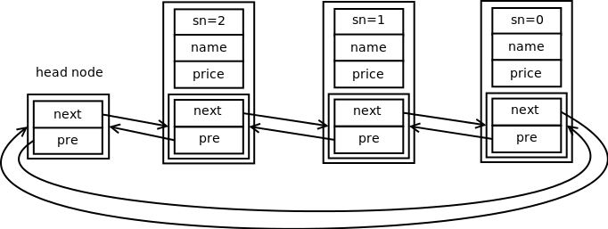

我以前在网上也看过不少文章讲解这两个宏的作用，但大部分文章都没有说明这两个宏的使用场景，因此我总是很疑惑什么地方需要用到它们，因为我们自己定义的结构体，难道还会不知道它的首地址吗，为什么还需要用成员的地址来获得整个结构体的首地址呢。

为了说明这个问题，我们先要从 linux 中的内核链表说起。linux 内核中定义了一个非常精炼的双向循环链表及它的相关操作。如下所示：

    struct list_head {
      struct list_head *next, *prev;
    };

ubuntu 12.04 中这个结构定义在 /usr/src/linux-headers-3.2.0-24-generic/include/linux/types.h 中，各种操作定义在 list.h 中。可以通过 `grep "struct list_head {"` 来查找到，也可以使用 ctags 在 include 目录下生成 tags 文件，然后在 tags 里面查找到。

这个链表只有指针域，没有数据域，所以我们不能直接拿来使用。而是需要把这个结构体嵌在我们自己定义的结构体里，可以放在任意位置，开头，中间或结尾。比如：

    struct book {
      int sn;
      char name[NAMESIZE];
      int price;
      struct list_head node;   //内核链表结构体放在最后
    }

我们使用内核提供的链表操作函数或宏来快速地建立一个双向链表，如下所示：

    int main()
    {
      struct book *bp;
      int i;

      LIST_HEAD(head);  //宏，建立头结点

      for(i = 0 ; i < 3; i++)
      {
        bp = (struct book *)malloc(sizeof(struct book));   
        /*if error*/

        bp->sn = i;
        snprintf(bp->name, NAMESIZE, "book%d", i);
        bp->price = rand()%60 + 20;

        /*insert*/
        list_add(&bp->node, &head);  //将该结点插入链表
      }
      /*TODO: travel*/
      
      return 0;
    }

注意，`LIST_HEAD(head)` 不是函数，而是宏，所以不要对它传了一个没有定义的变量感到疑惑。这个宏的定义如下：

    #define LIST_HEAD_INIT(name) { &(name), &(name) }

    #define LIST_HEAD(name) \
        struct list_head name = LIST_HEAD_INIT(name)

它的作用是生成了一个变量名为 name 的头结点，并把指针域的值都初始化为指向自身。

`list_add` 函数实现把节点插入到以 head 为头结点的链表中。

上述一段简短的代码，快速地生成了一个可供自己使用的双向循环链表，其结构如下图所示：

从图中可以看到，每个节点中的 next 和 pre 指针指向的都是另一个结点中的 node 成员的地址，而不是整个节点的首地址，所以，问题就来了，我们要访问节点中的其它成员怎么办？那我们就必须通过 node 成员的地址，获取它所在的节点的首地址。方法很简单，用 node 成员的地址减去它相对首地址的偏移量即可，假设某个节点的 node 成员的地址是 ptr，偏移量暂时先用 offset(node, struct book) 来表示，则公式如下：

    (struct book *) ( (char *)ptr - offset(node, struct book) )
    ~~~~~~~~~~~~~~~   ~~~~~~~~~~~   ~~~~~~~~~~~~~~~~~~~~~~~~~
     类型转换        转成指向char的指针  node成员在结构体中的偏移量  

那偏移量又该如何来计算呢，假想 struct book 这个结构体的首地址为 0，那么 node 节点的地址不就是偏移量吗？因此我们可以把地址 0 先转换成指向 struct book 的指针，再从这个指针取它的成员 node 的地址，就可以计算得偏移量，公式如下：

    ((size_t)    &((struct book *)0)->node)
     ~~~~~~~~    ~ ~~~~~~~~~~~~~~~~~
    转成无符号整数 取址      

也许不少人和我一样，有一个疑惑，地址 0 转换成指针，不是 NULL 吗，用它去**访问**成员，不是非法的吗？我一开始也百思不得其解，后来明白了，取成员的地址，并不等于访问该成员。我们可以用下面一段程序来验证一下：

    #include <stdio.h>

    struct st
    {
      int a;      //0
      char b;     //4
      int c;      //8
    };

    int main()
    {
      printf("c addr  : %d\n", &((struct st *)0)->c);
      printf("c value : %d\n",  ((struct st *)0)->c);

      return 0;
    }

在 ubuntu 12.04 32bit 上用 GCC 4.6.3 编译后运行的结果：

    sparkle@ubuntu:~$ ./a.out 
    c addr  : 8
    段错误 (核心已转储)

我是这么来理解的，地址 0 开始的这一段内存空间，就像是透明的充满机关的盒子，当里面放着结构体时，即使我们不打开这个盒子，从外面也可以知道里面的某个成员的位置(即地址)，但你想打开盒子取出某个成员看看它的具体的值是多少时，却是万万不可的，会中箭而亡！

通过上面的步骤，我们就取到了节点的首地址，内核它也是这么做的，把上面表达式里的 struct book 换成 TYPE/type，把 node 换成 MEMBER/member，就是内核定义的样子：

    /* 定义在 include/linux/list.h 中 */
    #define list_entry(ptr, type, member) \
        container_of(ptr, type, member)

    /* 定义在 include/linux/kernel.h 中 */
    #define container_of(ptr, type, member) ({          \
      (type *)( (char *)ptr - offsetof(type,member) );})

    /* 定义在 include/linux/stddef.h 中 */
    #define offsetof(TYPE, MEMBER) ((size_t) &((TYPE *)0)->MEMBER)

上面 `container_of` 为了便于理解，进行了简化，实际完整的定义是这样的：

    #define container_of(ptr, type, member) ({      \
      const typeof( ((type *)0)->member ) *__mptr = (ptr);  \
      (type *)( (char *)__mptr - offsetof(type,member) );})

它增加了一句，作用是通过 GCC 特有的类型运算符 typeof，取得 member 成员的类型，定义了一个此类型的指针 `__mptr`，并使它的值等于 ptr，后面就用 `__mptr` 替代 ptr 操作。这句话我想其实是多余的，可能是为了做最大的保护吧，可以通过下面这个例子来理解为什么要重新定义一个变量。

用 define 定义一个最简陋 MAX(a,b) 宏，像下面这样：

    #define MAX(a,b) a > b ? a : b

这样的定义不堪一击，MAX(a+1, b) 的调用就会让它出错。  
在 windows 下，最严谨的定义也不过如此了：

    #define MAX(a,b) ((a)>(b)?(a):(b))

可是这样的定义，在面对这样的调用时，依然无能为力：MAX(++a, ++b)，大家可以实验一下，其中的较大值会被加 2。

但在 linux 下，使用 typeof 运算符，可以解决这个问题：

    ＃define MAX(a,b) ({typeof(a) A=a,B=b; A > B ? A : B;})

不过这种在 () 里包含 {} 的定义方法并不被标准 C 支持。

对于上面的这种定义，或许还是有人会有这样的疑问，假如调用 MAX(++a, ++b)，a 还是会被加两次啊，typeof(++a) 时会加一次，A=++a 时又加一次。其实不会，因为 typeof 并不是一个运行时的函数或运算符，它和 sizeof 一样，是在编译的时候就确定了。下面这个例子可以验证：

    int main()
    {
      int a = 5;
      typeof(++a) b = 3;  //等同于 int b = 3;

      printf("a = %d, b = %d\n", a, b);

      return 0;
    }

    ---------------
    运行结果：
    a = 5, b = 3

如果我们把内核链表结构体放在我们自己的结构体的开头，其实就不需要这两个宏了，只需要进行类型转换即可。

另外，在 windows 内核中也有类似的宏，由于 windows 没有 typeof 运算符，所以就显得简单了一些，定义如下：

    #define CONTAININT_RECORD(address, type, field) \
      ((type*)((PCHAR)(address) - (PCHAR)(&((type*)0)->field)))

下面的程序将完整地展示如何使用 `container_of` 实现遍历。

    int main()
    {
      struct list_head *cur;
      struct book *bp;
      int i;

      LIST_HEAD(head);  //宏，建立头结点

      for(i = 0 ; i < 3; i++)
      {
        bp = (struct book *)malloc(sizeof(struct book));   
        /*if error*/

        bp->sn = i;
        snprintf(bp->name, NAMESIZE, "book%d", i);
        bp->price = rand()%60 + 20;

        /*insert*/
        list_add(&bp->node, &head);  //将该结点插入链表
      }

      /*travel*/
      __list_for_each(cur, &head)
      //这也是一个宏，展开后是这样：
      //for (cur = (&head)->next; cur != &head; cur = (&head)->next)
      {
        bp = list_entry(cur, struct book, node);
        //list_entry 与 container_of 等价
        printf("sn = %d, name = %s, price = %d\n", bp->sn, bp->name, bp->price); 
      }

      return 0;
    }
