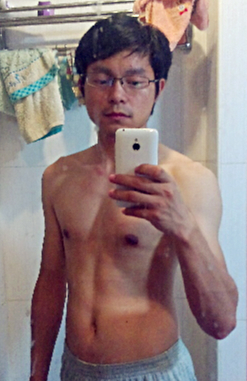

最近突然翻看以前的 blog，发现这些以前辛辛苦苦总结的 blog，可以帮助我迅速找回记忆或者曾经的知识结构。

然后回首自己最近的这两年，真的是我人生中非常重要的两年，这两年，我给自己总结的关键词是「改变」与「坚持」。

2012 年年底我中途离开豌豆荚的时候，工作上很迷茫，生活上一团糟，感觉自己的人生完全不在掌控之中，it sucks！于是我下定决心去做出一些改变。我给自己制定了一份 My Life OKR。今天，重新回首这份 OKR，很欣喜，很多目标都实现了，甚至超额完成。更重要的是，重新找回了生活的信心。

于是写下下面的文字，作为 2014 年的年度总结，也作为我人生一个重要阶段的总结。

从四个大的方面总结：工作，生活，自我提升，总结与展望。

### 一、工作
2014 的工作，对于我来说，无疑是非常开心的，充满了成就感，逐渐有了那种我一直梦寐以求的独挡一面，游刃有余的感觉。

这一年的主要工作是用 c++ 为上层 android/iOS/windows 应用编写底层核心功能库，用于和智能设备进行网络通信并进行各种控制。贡献了其中大部分代码（本来是三人开发，一人项目初期离职，一人中途调回去维护 1.0 项目），对每一行代码都了如指掌，一切尽在掌控之中的感觉妙不可言。

库使用了 google 的 libjingle 异步网络库作为框架，8 个以上的线程同时工作，使用了一些技巧，使除了框架本身消息队列的锁外，其它地方完全规避了锁的使用，这是我引以为豪的一点。对外的接口几乎全部是异步的，写完以后我才意识到这样的设计思想和 nodejs 有那么些相似之处。

为了写好这个库，阅读了不少开源代码（libjingle, pjnath, nopull, udt...），尤其是 libjingle 的 base 库，深刻地理解了它的网络及线程模型（画了一张 [UML 图](https://www.processon.com/view/54547f7c0cf2fa24a91afca6))。后来看 android 的 handler 机制时，不用看它的源码，就能想到其内部大致是怎么实现的。同时也理解了 P2P 的原理及实现。

2013 年末和 2014 年初的工作是为 linux 下的浏览器编写视频播放插件（可以理解为 flash 的简化版）。这个任务带给我很大的挑战，一来，我以前基本都是在 windows 下写程序，二来我没有写插件的经历，三来对于界面，也只是写过一些简单的 MFC 上的界面。也只好硬着头皮上，开始看 npapi, gtk, gdk, cairo, xlib, 还要看 ffmpeg, opengl 这些东西。这些对于我来说都是全新的东西，看得有点崩溃。光是如何在插件里绘制一个 gtk 控件就折磨了我两周，各种求问，google group, stackoverflow，相似的问题提了三四年都没有人解答。最后还是靠自己研究出来，当时的喜悦之情真是难以言表。最后也还是做出一个 demo 级的可用插件，播放，暂停，切码流，截图，基本功能也都有了。还好，公司最后还是取消了这种实现，不然我真是要深陷泥潭了。随后就把 npapi, gtk 这些知识忘得差不多了。gtk 开发简直是我的噩梦，以后再也不要接手这样的任务了。

不过，这次项目也不是完全没有收获，它让我明白了浏览器插件的工作机制，并且明白，所谓的 HTML 5 引进的 canvas, audio, video 这些元素，本质上就是原生的插件而已。至于界面开发的知识，对后面 android 的学习也是一种积累。

2014 年末，在库稳定以后，我转向了移动开发，开始支援 android 开发。这也是我的兴趣与发展目标。阅读了「授人以渔」的范老师的《Android 开发精要》和「授人以鱼」的《疯狂 Android 讲义》，在慕课网上看了一些视频教程后（慕课网是个好网站啊），已经可以参与团队开发了。目前感觉良好。

### 二、业余生活
2014 的业余生活对于我来说无疑是丰富多彩的一年，广泛地参与各种活动，主要集中在健身，跑步，骑行，游泳，以及旅行。工作和生活得到了很好的平衡。

说起来，运动原来并不在我的计划之内，我在 OKR 中制定的计划不过是每天在家简单地练上几个俯卧撑而已，生活总是充满了各种意外。

#### 健身
在我离开豌豆荚的时候，豌豆荚送给我一张潜水俱乐部的健身卡，这是我人生最珍贵的礼物之一，因为它无意中对我的人生起到了一些积极的改变。

我当时理所当然地以前这是一张年卡（汗，也不知道自己为啥会这么想）。于是把它扔在一旁，一扔就是一个月。后来偶然去问了一下，工作人员告诉我，这张卡只有三个月期限，而且售价不菲，好像要两三千的样子。我掐指一算，今后的两个月，必须每周来三到四次，每次一到两个小时，才能发挥这张卡的价值。我也这么去做了。自然而然，两个月以后，我已经开始享受这种肌肉酸痛的感觉。

卡到期后，我就自己去北邮健身房办了便宜的健身卡，但是去的不再那么频繁，大约每周去一次。现在的公司也提供免费健身福利。其余时间，主要是下班后的晚上，花大约半小时到一个小时，买了瑜珈垫，在家交叉练习俯卧撑和卷腹，深蹲，后来还买了哑铃。健身的习惯就这么保持了下来。但也没有说每天都坚持练，累，或者忙，懒的时候就不练，但中间不会间隔太久（因为会有愧疚感）。我也没有把「八块腹肌」作为急切的目标。一来，看了李笑来的《与时间做朋友》，我开始用「推迟满足感」这样的思想来指导我长期坚持做某件事情，即把这件事情的成果推迟到更久远的将来去收获。二来，我只是希望这样的锻炼可以使我将来免于在工作时的猝死（身体脆弱的时候曾经有过这样的担心）。

开始享受健身后，就开始学习与健身相关的知识。在微博上关注了很多与健身相关的账号（早上六七点起来打开微博一看，满屏都是这些健身账号发的微博），在知乎上看相关的帖子（好像只记得陈柏龄这个名字了）。学习各种动作，学习正确的饮食。

很喜欢施瓦辛格在他的《健身大全》里说的这么一段话：「健身训练还是一种让你的生活变得规律、有节制的好方法。当你通过训练让你的体质得到增强时，你就会变得更加注重饮食习惯。... 你必须控制你的日程，确保训练的进行，这也意味着更好地安排你的业余时间。坏习惯呢？像吸烟和酗酒这类事情，可能会干扰你的训练效果，影响身体的进步。明天进行晨练！千万不要熬夜 ... **如果你用健身运动来规范你的生活，它不仅会对你的身体和精神产生影响，也会改变你的所作所为，改变你身边的人。**」

所谓用健身运动来规范你的生活，就比如说，不是因为今天夜里要看一场比赛，所以你要放弃明天的晨练，而是因为明天早上需要晨练，所以你必须不能熬夜，必须放弃夜里的这场比赛。

#### 跑步
跑步，我的 OKR 里根本没有出现过这两个字。

2013 年 6 月份的时候，我妹妹在微博上分享了一个视频给我，标题叫「男生看了会爱上女主角，女生看了会爱上跑步」（标题嘛），看完以后，我大脑不知哪根神经被触动了，我对自己说，我也要去跑马拉松。两周以后的某天晚上，我踏上了北师的操场。也许是得益于之前健身打下的基础，我第一次跑就跑了十多圈，大概有 5 公里，没有丝毫地气喘吁吁，这让我大为惊讶。从此，差不多每周去北师跑两次。莫名其妙地就这样爱上了跑步。

但是到 2013 年底的时候，脚踝疼了起来，于是休养，并购置了专业的跑鞋。休养到去年 3 月份，万物回春，又一次上路。并把夜跑改为晨跑，从北师转战到后海，由 5 公里变成 8 公里，由半小时变成近 1 小时。清晨，跑在安静的路上，呼吸着清新的空气，看着后海的风景，感觉是极好的。而当我跑步回来的时候，室友们还在睡梦中。

#### 骑行
骑行，不光 OKR 里根本没有提及，我甚至略有些反感呢。

我最好的朋友，前室友，喜欢骑行，买了辆美年达山地车上下班，老怂恿我买车，我一说无聊的时候，他就在一旁边唠叨，买车吧，买车吧，买了一块出去玩。我说，太贵啦，我以前 100 多的车也照样骑啊。其实我是完全没有兴趣的。后来终于被他逮着机会了，他说他们群里有人卖二手公路车，才 800。我心想，才 800，都够我买双跑鞋了。我被他实在是烦得不得了，索性就说那就去看看吧（我一直觉得，我这朋友是天生的推销员）。于是就去了，试骑了一下，那应该是我第一次骑公路车，哟呵，感觉不错的样子啊，于是果断买之。后来，我把它视为提升我幸福感最强烈的物件。

随后，就开始跟着小伙伴一起踏上了征途，相继去了 妙峰山（这个是 2013 年底去的），天津，十渡/野山坡，温榆河，东方红隧道/京西十八潭。每次出发前，我心里都会犯嘀咕，这么远，我们能坚持下来吗？遇到过大风大雨，成员受伤等各种意外，只是当我们拖着满身疲倦回到家的时候，再回想那些意外简直是不值一提。

不远行的时候，每周骑车一两次上下班，或者周末清晨沿着二环骑一圈，甚是惬意。骑车活动受制于天气，主要集中在春夏。入冬以后基本就没有再骑了。

#### 游泳
今年游泳上最大的突破是终于学会了自由泳，以及学会了踩水。以及发现自己可以轻松地用蛙泳游上 1000 米，而 OKR 中的目标仅仅是 200 米。

在游泳这件事情上，体会最深的就是量变到质变的过程。很多技能挣扎着，尝试着，很长时间都觉得没有什么进展，在某一时刻突然就掌握了。

今年还参加了几个赛事，比如「北京跑」，「彩色跑」，纯娱乐性质。比较有成就感的是奥运距离半程铁人三项，尤其是在湖中游 750 米的经历，那是我第二次在泳池浅水区以外的地方游泳（第一次是去深水区考深水证，失败了...），说真的，那段过程中我脑中唯一的想法就是如何活下来。

#### 挫折
今年最不开心的事情就是下半年开始身体遭遇各种伤病。先是六月份，膝盖开始隐隐作痛，到八月份只好把跑步停止了，后来也只零星地跑过几次。八月份在健身房做卷腹时把腰扭了一下，后来就不敢再做卷腹了。到九月份更惨，铁人三项后发现右肩膀疼得历害，代码都快没法写了，去了两次医院，虽然我深表怀疑，但每次我还没开始描述整个经历，医生捏了捏，就说，颈椎病啦，让我多抬头，做做小燕飞之类的。我一直想，我都这么经常锻炼还居然得颈椎。程序员们可得多注意了呀。然后俯卧撑也只好停掉了。

十月份是去年的一个低谷，感觉什么都做不了了，很沮丧。后来只好告诉自己要面对现实，有些小伤小病在身上也是好事，可以时刻提醒自己健康是多么珍贵。然后开始积极地进行各种康复训练，主要是早上做各种抬腿动动，小燕飞，拉伸等。晚上稍微练练哑铃。

把「跑一次全马」从梦想清单中划除，膝盖好了话，只要每周能跑上两三次 5 公里我就满足了。

#### 旅行
在 OKR 中计划每年至少去一座别的城市。

2013 年去了平遥，看了传说中的平遥古城墙。2014 年骑车去了天津，公司组织去了唐山海边的岛上游玩，第一次到海里游泳（也是最后一次，海水太 TM 咸了）。不过这都不算是正式的旅行。

2104 正式的旅行赶在最后一天，看完了平遥的城墙，就该去看西安的城墙了，不知为什么，好像对城墙有一种特殊的情结。我在西安的城墙上走了四分之一，骑了四分之三，居然还花掉了近 5 个小时。

旅行路上遇到了很多有趣的小伙伴们，也是另一种收获。

### 三、自我提升

#### 技术
除了因为工作需要，钻研了 libjingle 等一些开源库，学习 android 外，业余时间，看了看 nodejs，了解了一下其设计思想。swift 语言刚出来的时候，跟着学了一阵子。重新把 python 学了学，并学习了 flask 框架。

由于所谓的「兴趣广泛」，这些年我的职业发展其实颇为不连贯，从底层到顶层都经历个遍。从最底层的 芯片内电路设计（FPGA，使用语言 Verilog/VHDL），到 芯片外电路设计（画板子，焊板子），嵌入式开发（51 单片机/ARM，汇编 & c），驱动（linux/windows 内核开发，c），再到应用层开发（c++/c#），移动开发（android，java）。web 方面也看了一些，php/python/html/css/js。但除了 c/c++ 外，其它的终究是浮光略影，钻研得极浅。虽然看过很多关于 html/css/js 的书藉，但我还是写不出一个漂亮的网页。

有时我在想，如果一个人从上大学或开始工作的时候就一直钻研一项技术，比如 java 或 php，那他现在工作起来一定很轻松吧。所以 2015 年，我想收起我的这种「兴趣广泛」，专心地研究 android，让自己在这方面变得更专业。

#### 阅读
2014 年初购置了渴望以久的 kindle papar white。于是重温了一些老书，看了部分新书，大部分是通俗易懂的，太深奥的看不了。有《平凡的世界》《百年孤独》《三体》《陆犯焉识》《小王子》《了不起的盖茨比》《乡土中国》《神似祖先》《城南旧事》《边城》《北洋裂变》《穷爸爸富爸爸》《完美关系的秘密》，以及村上的一些作品，《挪威的森林》《1Q84》《且听风吟》《当我跑步时我在谈些什么》，王小波的一些作品《青铜时代》《白银时代》。

回首一看，居然还是看了不少的呢。2015 继续扩大阅读量。

#### 习惯养成
2014 年更多的是坚持 2013 年养成的良好习惯。

最重要的习惯就是规律的作息，早睡早起，这一点上我超有成就感。2014 比 2013 做得还要好，全年大部分时间都做到了 12 点前睡觉，早上平均起床时间是 6 点半（2013 年是 7 点），并且很长一段时间都不需要闹钟。夏天的时候由于晨跑，6 点半太阳就已经很大了，所以要起得更早。十月十一月份的时候是低谷，经常 7 点多才起。如今借助闹钟重新调整回了 6 点半。（有时觉得自己特别不像人们眼中所谓的程序员。）

坚持吃早餐，而且是自己做的早餐。

坚持写日记。当然，两三天攒一起写，或者日记变成周记的情况也时有发生，但我并不以为然，只要不长期中断，我都视之为一种我所认为的「坚持」。就好比人们一般用「三天打鱼两天晒网」来形容人们做事情不够坚持，而我认为如果能做到差不多每周都「三天打鱼两天晒网」，那就是一种坚持。

我的日记就是一些流水账，并无任何文学价值，更无提升写作水平的作用。

日记还用来消除内心的一些愧疚感，每当觉得最近过得太过堕落的时候，就会在心里自责，只要把这些自责写到了纸上（如今是云笔记），然后告诉自己下周一定要好好过后，心里的这种愧疚感就烟消云散了。有时回过头一看，顿时觉得自己可笑至极。

周日的日记往往是这样的，这周状态太差了，这周工作效率很低，这周没锻炼，这周起得太晚，下周一定要怎么怎么样，然后往往是，第二周，周一周二贯彻得还不错，周三周四开始懈怠，周五周六就开始乱套，周日又是新一轮的反省，周而复始。我并不为之烦恼，而是视之为一种人生常态。

坚持写工作日记。每天早上写下今天的 todo，然后把工作中遇到的问题及解决办法都记录下来，作为经验的积累。（此时，我想说，有道云笔记是个好东西！）

以上是坚持得不错的习惯。

做得不好的，一是 OKR 里期望每周写一篇 blog，回首一看，2014 居然一篇 blog 也没写，实在令我震惊，貌似是完全忘记了这茬事。看来这件事实施难度略大，也罢，2015 尽力而为吧。

另一件是每周（后来调整为每月）为自己照一张相，以便在年老时可以回顾自己逐渐老去的经过。这件事其实一直没有实施过。

#### 时间管理
虽然我起得算早，睡得不算早，但我仍然觉得一天的时间不够用。尤其是晚上，一般 8 点到家，然后随便刷刷网页，看看视频，一两小时就过去了，再洗漱锻炼，转眼就 11 点多了，再想学点什么时间俨然已经不够了。工作中，虽然上班时间很少看无关的网页，但却很容易被手机分心，以致不够专注。

2014 年 6 月份参加了马占凯老师举办的一个关于戒网瘾和战胜拖延症的讲座。回来后，开始看一些关于时间管理方面的知识，相继看了《与时间做朋友》《奇特的一生》《30 岁前的每一天》《时间投资法》，相继尝试了一些工具，比如 Doit.im，Tower.im，番茄土豆 等。（又要来广告了，番茄土豆是个好应用）。我用了番茄土豆很长一段时间，大概有 4 个月，之前都很 OK，可是后来在我电脑上 bug 不断，在 chrome 上一个番茄结束后不弹出通知（可能是 chrome 升级后导致的），手机上的 app 状态经常是紊乱的。后来就放弃了。

如今，返朴归真。用回了最原始的有道云笔记记录 todo，在电脑上安装了一个同事推荐的小工具，每过半小时就自动黑屏几分钟，然后趁这几分钟到处走动走动，喝杯水，抬抬头。为了减少手机的分心，尽量把手机放到抽屉里。这样的效果也还蛮不错。

不够专注是我在自我完善的道路上最大的障碍，2015 希望在攻克这个障碍上有所进步。

#### 语言学习
一直梦想着要学会日语，大学的时候学了一半五十音图后（只学会了平假名），这么多年都毫无行动。2014 我终于下定决心再次迈出了这一步。
虽然学得很缓慢，几个月过去了，才学到新标日第五课。但与几个月前的一无所知相比，也算是巨大的进步了。

2015 的目标是去尝试考一考日语证。

### 四、总结与展望：
2014 年，结识了很多优秀的小伙伴，他们或者拥有各种才艺，或者经历丰富，或者热爱运动，或者兼而有之。努力变得像他们这么优秀，是我前进的动力之一。

2015 年没有特别长远的目标，因为即使有，也可能会在将来的周记中被不断调整。只要能够保持现有的状态，继续 work hard, enjoy life 就好。

2015 年，继续丰富自己的经历。丰富的经历，对于相互提高各方面的认知是很有帮助的，我也是逐渐才体会到。比如我最近开始看吴军的《文明之光》，开篇讲到地球的诞生和人类的进化，我就想到《神似祖先》中讲到的关于生物进化的理论，看到古埃及文明是通过一块罗塞塔石碑发现的，我就会想起在陕西历史博物馆中听到导游所说的，有些文物之所以珍贵不在于文物本身，而在于上面的文字或图案，它们或者描绘了当时的某个生活场景，或者描绘了某个事件，从而让考古学家得以还原当时的社会风貌。又比如，我以前一直不理解英语发音中的变音，比如 t 变成 d，学了日语的送气音与不送气音后恍然大悟。

2015 最大的愿望是身体恢复如初，可以和小伙伴们尽情地去参加各种活动。

以上即为我的 2014 年年度总结。

最后，无图无真相，羞涩地晒张老图。

