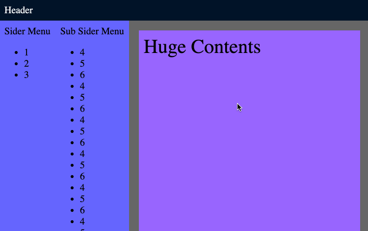
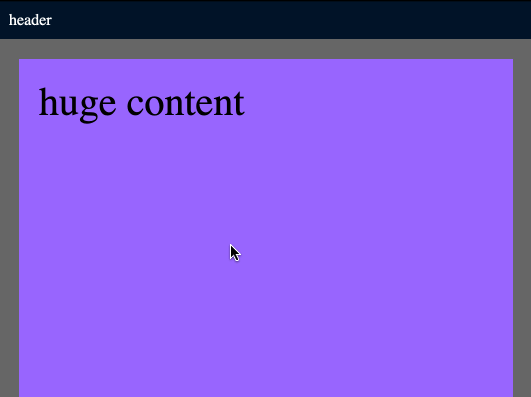
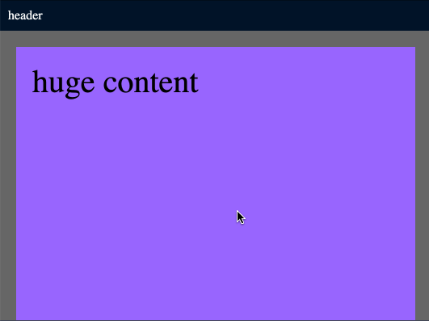
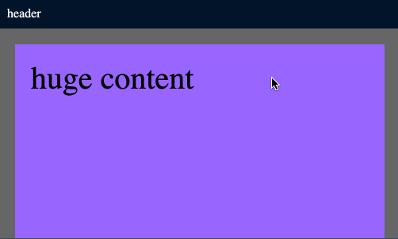

最近实现了一个需求，一个页面，需要固定的 header，固定的左侧栏，右侧的内容部分又有一个左侧栏，这个左侧栏也需要固定，其余的内容是正常展示，超出的部分显示滚动条。左侧栏虽然是固定的，但如果内容超出页面高度，也显示滚动条。

效果大致如下所示：

代码：[CodePen](https://codepen.io/baurine/pen/KYWVdp)

因为项目用了 React 和 Ant Design，Ant Design 有 Layout / Header / Sider / Footer / Content 等相关布局组件，根据文档，实现起来很快很方便，代码如下所示：

    import { Layout } from 'antd'
    const { Header, Sider, Content } = Layout

    ...
    render() {
      return (
        <Layout>
          <Header>
            
Header

          </Header>
          <Layout>
            <Sider>
              
Sider Menu

              <ul>...</ul>
            </Sider>

            <Layout>
              <Sider>
                
Sub Sider Menu

                <ul>...</ul>
              </Sider>

              <Content>
                
Huge Contents

              </Conten>
            </Layout>
          <Layout>
        </Layout>
      )
    }

好奇它是怎么实现的，于是通过 inspect，把它用原始的 html 和 css 翻译了一下，如下所示：

    // html
    

      

        

          Header
        

        

          

            
Sider Menu

            <ul>...</ul>
          

          

            

              
Sub Sider Menu

              <ul>...</ul>
            

            

              

                Huge Contents
              

            

          

        

      

    

    // css
    html, body {
      margin: 0;
      /* very important */
      /* height: 100%; */
      /* width: 100%; */
      font-size: 20px;
    }

    .container {
      /* very important */
      height: 100vh;
    }

    .ant-layout * {
      box-sizing: border-box;
    }

    .ant-layout {
      height: 100%;
      background-color: #666;
      
      display: flex;
      flex-direction: column;
      flex: auto;

      min-height: 0; /* fix bug in firefox */
    }

    .ant-layout.ant-layout-has-sider {
      flex-direction: row;
    }

    .ant-layout-header {
      flex: none;
      background-color: #001529;
      color: white;
      padding: 10px;
    }

    .ant-layout-sider {
      background-color: #6666ff;
      padding: 10px;

      flex: none;
      overflow-y: auto;
    }

    .ant-layout-content {
      flex: auto;
      overflow: auto;

      min-height: 0; /* fix bug in firefox */
    }

    .my-content {
      margin: 20px;
      padding: 10px;
      font-size: 40px;
      height: 2000px;
      background-color: #9966ff;
    }

最终效果就是上面那个 gif。

Layout 对应的 css class 是 ant-layout，Header 对应的是 ant-layout-header，Sider 对应的是 ant-layout-sider，Content 对应的是 ant-layout-content。

注意，实现这个效果有一个很重要的地方，我也是 inspect 也很久以后才发现，首先就要限制整个页面的高度就是 window 的高度，有两个实现方法，一是在给 html 和 body 设置 `height: 100%;` 的 style，Ant Design 是这么做的；一种是在最外层加一个 div container，设置 `height: 100vh;` style。如果不做这一步的话，效果是无法实现的。

ant-layout 作为 flex 容器，ant-layout-header / ant-layout-sider / ant-layout-content 作为 flex 容器的子元素。但 ant-layout 可以嵌套，所以它也是 ant-layout 的子元素。

ant-layout 使用 flex 布局，默认是上下布局 (cloumn)，但如果里面有 sider，则要给它加上 ant-layout-has-sider class，`.ant-layou.ant-layout-has-sider` 会使 flex 变成左右布局 (row)。

ant-layout-header / ant-layout-sider 作为子元素，它们的 flex 属性是 `flex: none;` 即 `flex: 0 0 auto;`，它们的尺寸即不拉伸，也不压缩。

ant-layout 作为子元素时，它的 flex 属性是 `flex: auto;` 即 `flex: 1 1 auto;`，它的尺寸会占握父容器中所有剩余空间，有多余空间时拉伸，空间不足时压缩。

同时 ant-layout 还有 `height: 100%;` 的 style，这样能保证它作为页面的顶级节点时可以占据整个页面的高度。

ant-layout-content 作为子元素，它和 ant-layout 一样，flex 属性是 `flex: auto;`，这意味着它也占据所有剩余空间，但它同时还有 `overflow: auto;`，这表明，如果内容超出页面高度或宽度，会显示滚动条。

这样，就很好理解上面这个效果是怎么实现的了。

首先，最外层是上下结构，ant-layout-header 占据自身内容的高度，下面剩下所有空间被 ant-layout 占据。下面的 ant-layout 变成左右结构，左侧的第一层 ant-layout-sider 占据自身内容的宽度，右边剩下所有空间被 ant-layout 占据。右边的 ant-layout 仍然是左右结构，左侧 ant-layout-sider 占据自身内容的宽度，右侧剩下所有空间被 ant-layout-content 占据。又因为 ant-layout-content 设置了 `overflow: auto;` 属性，它的内容如果超出容器高度或宽度，则显示滚动条。

我们再来对比一下用 flex 和用传统方法的实现，看看 flex 的优势何在。

来看一个最简单的例子，只固定 header，下面的内容滚动显示。

layout:

    // html
    

      

        
header

      

      

        
huge content

      

    
>

    // css
    html, body {
      margin: 0;
      background-color: #666;
    }
    .my-header {
      background-color: #001529;
      color: white;
      padding: 10px;
    }
    .my-content {
      margin: 20px;
      padding: 20px;
      font-size: 40px;
      height: 2000px;
      background-color: #9966ff;
    }

初始效果：

目标效果：

### flex 的实现

把 `.layout` class 设置为 flex 上下布局，`.layout-header` 的 flex 为 none，`.layout-content` 的 flex 为 auto，overflow 为 auto。以及 html 和 body，`.layout` 的 height 为 100%。

    html, body {
      margin: 0;
      background-color: #666;
      height: 100%;
    }
    .layout {
      height: 100%;
      display: flex;
      flex-direction: column;
    }
    .layout-header {
      flex: none;
    }
    .my-header {
      background-color: #001529;
      color: white;
      padding: 10px;
    }
    .layout-content {
      flex: auto;
      overflow: auto;
    }
    .my-content {
      margin: 20px;
      padding: 20px;
      font-size: 40px;
      height: 2000px;
      background-color: #9966ff;
    }

效果：

### `position: fixed`

设置 `.layout-header` 的 position 为 fixed，设置 top 为 0 使之置顶，如此设置之后发现 content 的一部分内容被 header 遮挡住了，于是我们要把 content 的 margin 再增加一个 header 的高度，因此，这就是使用 `position: fixed;` 一个弊端，必须知道 header 的高度，要么给它一个固定的高度，要么运行时用 js 动态计算。

所以我们给 `.layout-header` 一个固定的 38px 高度，对 `.layout-content` 设置一个 margin-top 为 38px，同时设置 `overflow: hidden;` 使之成为一个 BFC，消除和 `.my-content` 的 margin collapse。

    html, body {
      margin: 0;
      background-color: #666;
    }
    .layout-header {
      position: fixed;
      top: 0;
      width: 100%;
      height: 38px;
    }
    .my-header {
      background-color: #001529;
      color: white;
      padding: 10px;
    }
    .layout-content {
      margin-top: 38px;
      overflow: hidden;
    }
    .my-content {
      margin: 20px;
      padding: 20px;
      font-size: 40px;
      height: 2000px;
      background-color: #9966ff;
    }

效果：

注意，它的滚动条是从 window 的最顶部开始的，而 flex 方案是从 content 区域开始的。

### 原始布局

原本 div 就是上下布局，所以我们尝试一下既不用 fixed 也不用 flex，css 如下所示，最终效果和 flex 是一样的。核心在于将 `.layout-content` 的尺寸设置为页面高度减去 header 的高度，overflow 为 auto。header 需要一个固定高度。

    html, body {
      margin: 0;
      background-color: #666;
      height: 100%;
    }
    .layout {
      height: 100%;
    }
    .layout-header {
      height: 38px;
    }
    .my-header {
      background-color: #001529;
      color: white;
      padding: 10px;
    }
    .layout-content {
      height: calc(100vh - 38px);
      overflow: auto;
    }
    .my-content {
      margin: 20px;
      padding: 20px;
      font-size: 40px;
      height: 2000px;
      background-color: #9966ff;
    }

结论：flex 更方便和灵活，不需要知道 header 和 sider 的尺寸。
