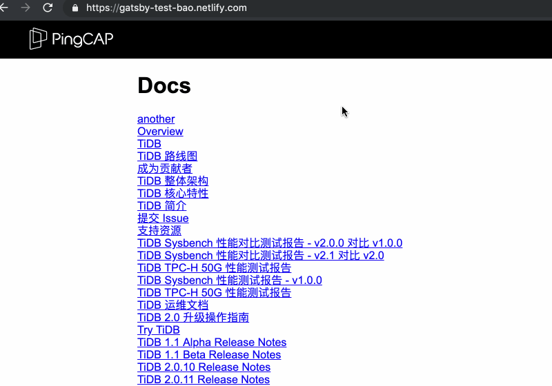
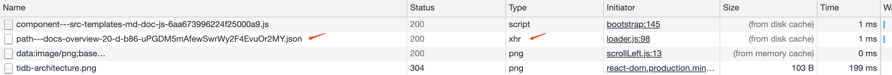
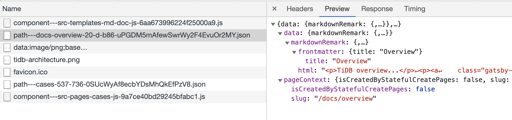
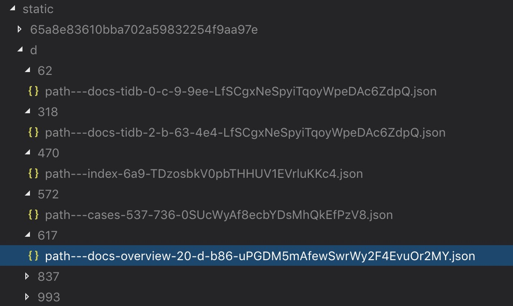
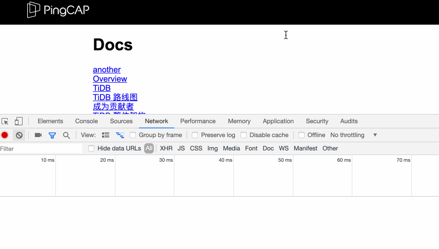
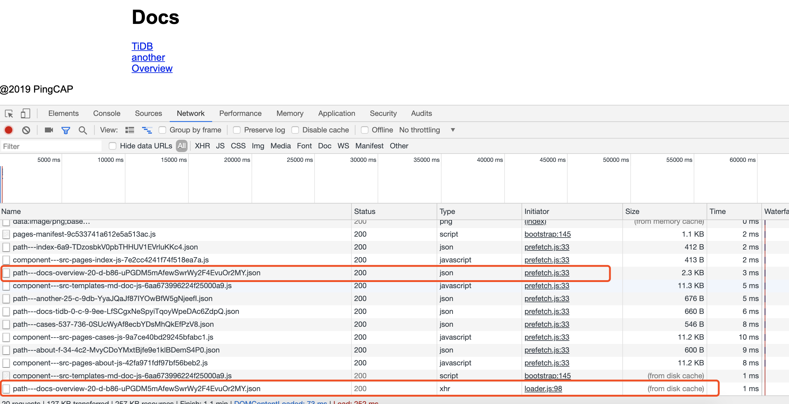
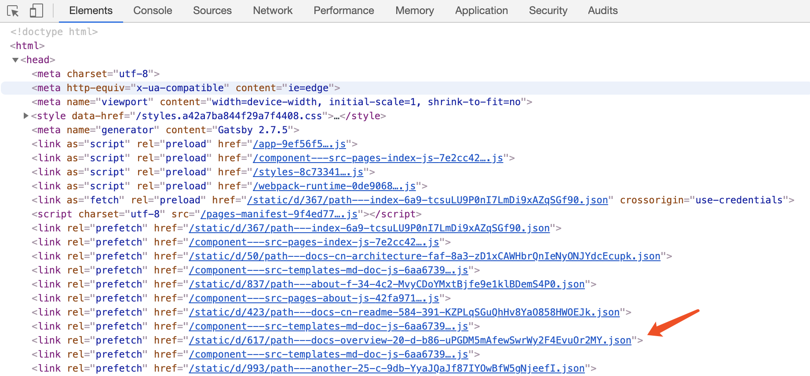
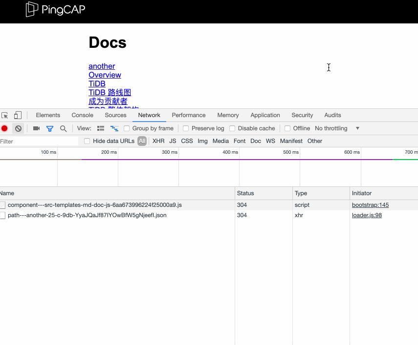

gatsby 相比其它静态站点生成器 (Jekyll / Hugo ...) 有一个很特别的地方，它能实现站内页面间无刷新的跳转。当然，前提在代码中使用的 Link 组件作为链接。比如：

```javascript
<Link to="/about">About</Link>
```

而不是直接用 `<a>` tag。比如：

```javascript
<a href="/about">About</a>
```

而且，当你点击链接时，页面可以被瞬间显示出来 (但并不是绝对的，取决于网速和页面上的链接数)，似乎该页面已经被提前下载了，所以 gatsby 的 slogan 是 "build **blazing fast** websites and apps"。

我们来感受一下：



那它是怎么实现的呢？

## 无刷新跳转

首先来看无刷新的页间跳转是怎么实现的？

这个其实很好理解，就跟 SSR 一样，当我们访问 gatsby 生成的一个静态页面时，只有首屏内容是来自提前渲染的静态内容，这个静态页面中同时会包含 bundle 出来的 react js 代码，当静态页面完全 load 后，js 开始在客户端工作，它会把整个页面用 js 重新渲染一遍，同时接管所有的路由，此时它成为一个 SPA。

当点击某个站内链接后，js 代码根据路由去渲染相应的 page component。

那么新的问题来了，page component 中的数据来自何处，对于一般的 SPA 来说，是通过 API 去访问后台拿到数据。但 gatsby 是静态站点生成器，没有后台服务器，要显示的数据难道都 bundle 在 js 代码中吗？假如我一个站点有几百篇 markdown，这些 markdown 的内容要都 bundle 在 js 代码中，不现实也不合理。又亦或是像 Turbolinks 那样由 js 去请求 html 页面？

与其猜测，不如我们来 inspect 一下。

我们点击某个 markdown 生成的页面链接后，在 inspect 的 Network tab 下可以看到，发出了一个 ajax 请求，请求了一个静态的 json 文件。



可以稍微看一下 gatsby 的实现代码，在 loader.js 98 行：

```javascript
const fetchResource = resourceName => {
  // Find resource
  let resourceFunction
  if (resourceName.slice(0, 12) === `component---`) {
    resourceFunction = asyncRequires.components[resourceName]
  } else {
    if (resourceName in jsonPromiseStore) {
      resourceFunction = () => jsonPromiseStore[resourceName]
    } else {
      resourceFunction = () => {
        const fetchPromise = new Promise((resolve, reject) => {
          const url = createJsonURL(jsonDataPaths[resourceName])
          const req = new XMLHttpRequest()
          req.open(`GET`, url, true)
          req.withCredentials = true
          req.onreadystatechange = () => {
            if (req.readyState == 4) {
              if (req.status === 200) {
                resolve(JSON.parse(req.responseText))
              } else {
                delete jsonPromiseStore[resourceName]
                reject()
              }
            }
          }
          req.send(null)
        })
        jsonPromiseStore[resourceName] = fetchPromise
        return fetchPromise
      }
    }
  }
```

这个 json 文件中的内容，有一部分正是渲染这个 page component 所需要的 data。如下所示：



page component 的代码实现：

```javascript
import React from "react";
import { graphql } from "gatsby";
import Layout from "../components/layout";

export default ({ data }) => {
  return (
    <Layout>
      <h1>{data.markdownRemark.frontmatter.title}</h1>
      <div dangerouslySetInnerHTML={{ __html: data.markdownRemark.html }} />
    </Layout>
  );
};

export const query = graphql`
  query($slug: String!) {
    markdownRemark(fields: { slug: { eq: $slug } }) {
      html
      frontmatter {
        title
      }
    }
  }
`;
```

可见，gatsby 将每个页面通过 graphql 查询得到的数据保存到了单独的 json 文件，每个页面对应一个 json 文件。

可以在 public/static/d 目录下看到这些 json 文件：



当点击页面内的链接进行跳转时，客户端的 js 代码使用 Link 组件，阻止了默认的刷新跳转行为，而是发出 ajax 请求去获取相应的 json 文件获得数据，然后渲染相应的 page component。

## 瞬间加载

如果我们再仔细观察的话，可以发现在请求 json 的 ajax 请求并不是在 click 的时候发出的，而是在鼠标 hover 到链接上就发出了，这个 tricky 给我们争取了一些时间，尽早把数据取回来，以给用户造为成一种加载速度很快的错觉。



但是，再仔细观察，你会发现，这个发出去的 ajax 请求的数据居然是 `(from disk cache)` (如上面第二张截图所示，不过并不绝对，取决于网速和页面上的链接数)，所耗费时间是 1ms，"blazing fast" 还真他娘的不是自夸。

这说明，这个请求在 hover 之前就已经发出去了！有点狠。

那到底是什么时候发出去的呢，重新刷新一下页面，发现 Network tab 下有一些这样的请求：



显示这个 json 文件已经被 prefetch.js 进行 prefetch 了，实现代码在 prefetch.js 第 33 行，点进去看看：

```javascript
const linkPrefetchStrategy = function(url) {
  return new Promise((resolve, reject) => {
    if (typeof document === `undefined`) {
      reject();
      return;
    }

    const link = document.createElement(`link`);
    link.setAttribute(`rel`, `prefetch`);
    link.setAttribute(`href`, url);

    link.onload = resolve;
    link.onerror = reject;

    const parentElement =
      document.getElementsByTagName(`head`)[0] ||
      document.getElementsByName(`script`)[0].parentNode;
    parentElement.appendChild(link);
  });
};
```

这段代码在 document 的 head 部分动态地插入了 link tag，如下图所示：



这里用到了 HTML5 的 prefetch 特性。加上了 `rel="prefetch"` 的 link tag，其相应的资源会被浏览器在空闲时间提前下载缓存在本地。

详情可以从这篇文章了解 - [[译]Preload，Prefetch 和它们在 Chrome 之中的优先级](https://juejin.im/post/58e8acf10ce46300585a7a42)

当然，如果一个页面中有很多很多链接，对所有这些链接都进行 prefetch 会产生很多多余的请求，也会让真正需要 prefetch 的链接没法优先 prefetch。gatsby 会监听页面的滚动，只对可视范围内的链接进行 prefetch。如下图所示：



## 总结

总结 gatsby blazing fast 的实现：

1. 页面加载后尝试对页面内出现的链接进行 prefetch
1. hover 某个链接时，使用 ajax 请求对应的数据 json (其实还有 js 和 css)，它们如果已经被 prefetch 缓存在本地，那么可以很快从本地缓存得到，否则从静态服务器获得
1. 点击链接，经过前面两个双保险，此时该链接所需数据已经大概率在本地了，所以页面可以大概率被瞬间显示出来

从上面的分析过程和一些截图中也可以看出，gatsby 还做了一些其它工作来让页面能尽快加载出来，比如将 js 和 css 进行了 split，对每个页面的 js 和 css 也进行了 prefetch，不过一般情况下大部分 markdown 页面的 js 和 css 是一样的，这部分 js 和 css 会在浏览第一个 markdown 页面时就被下载，后面浏览其它页面就不用再下载了。
