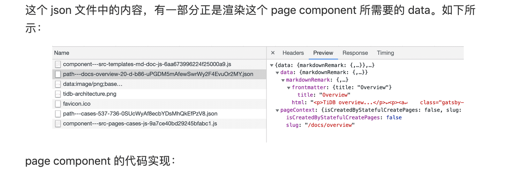

使用 gatsby 建 blog 站，我们一般会使用 gatsby-remark-images 插件对图片进行处理，可以实现和 medium 相似的效果，加载网页上的图片时，图片会有一个由模糊逐渐变清晰的过程，而且大图会被自动压缩成适成当前屏幕尺寸的小图，极大地提升了用户体验。这是怎么做到的呢，我们来分析一下。

// TODO: 添加效果演示 GIF

首先来 inspect 一下网页。对 https://baurine.netlify.com/2019/06/05/why-gatsby-blazing-fast/ 这篇文章中的某张图片进行 inspect。



其代码如下所示：

```html
<p>
  <a
    class="gatsby-resp-image-link"
    href="/static/90c096d597121a2a778ca6d32e526715/1f7b6/json-content.png"
    style="display: block"
    target="_blank"
    rel="noopener"
  >
    <span
      class="gatsby-resp-image-wrapper"
      style="position: relative; display: block;  max-width: 590px; margin-left: auto; margin-right: auto;"
    >
      <span
        class="gatsby-resp-image-background-image"
        style='padding-bottom: 23.5362%; position: relative; bottom: 0px; left: 0px; background-image: url("data:image/png;base64,iVBORw0KGgoAAAANSUhEUgAAABQAAAAFCAYAAABFA8wzAAAACXBIWXMAABYlAAAWJQFJUiTwAAABA0lEQVQY012Pi06DQBBF+f9/szWWapuoLbAs8ijsAuWxQI9Takx0kpOZTHbv3OvpJCHNMuJYE+sHUaQIo2jtRVFgjCFLM5RSfAQh76cArWMy+VeWJde2/cV72mzZbJ952fm8vh3Y+Xv8/X7tdw6HIypWNKYhD3LOx4gwjDHW0vU9/8s7nQMiFVPXNfM04ZxjmgT3YBxHhmFgWRaa9IoNLsKZKtHYS0Fb5ExDj2saRkniBWEkkXN08iVxE3GjJa5aqeTB9HNk7Eeq0FKKy+KkyD4VF5WTJgVVWXEVQ21V4VkZalE3xq4xjK3X+S7WdT3LPK+iy3LDdQ5Xt8x35MBtAVn/qW9o0XmtA2tt+wAAAABJRU5ErkJggg=="); background-size: cover; display: block; transition: opacity 0.5s ease 0.5s; opacity: 0;'
      ></span>
      
    </span>
  </a>
</p>
```

最外层的 p 忽略。然后就是 a 标签，虽然在此网页中我们看到的是缩略图，但仍然允许通过点击这张缩略图，在新的 tab 中浏览原始大图。

接下来是 class 为 gatsby-resp-image-wrapper 的 span，从 class 的名字可以它是一个 wrapper，实际 img 的容器。来看看它的 style 属性。

- `position: relative;` - 为容器中的 img 元素使用 absolute position 做准备
- `display: block; max-width: 590px; margin-left: auto; margin-right: auto;` - 使容器最大宽度 590px，容器中的元素居中 (max-width 为什么是 590px，这是自己在 gatsby-remark-images 插件的 options 中设置的)，没有指定高度，高度由子元素决定

既然是容器，为啥不用 div 呢，因为它在 a 标签中... a 是行内元素，虽然 display 设置成了 block，但不能改变它是行内元素的本质，行内元素内部不能嵌块元素。

接下来看 class 为 gatsby-resp-image-background-image 的 span 元素，从名字可以看出，它是作为背景使用的。

它的几个作用：

- `padding-bottom: 23.5362%; position: relative; bottom: 0px; left: 0px;` - 为实际图片占位，padding-bottom 的值即图片的高度，以免图片加载后页面产生跳动，为什么用百分比，而不是一个固定的值，后面我们会讲到，因为在不同的屏幕尺寸下，会显示不同尺寸的图片，它们的高度是不一样的，但宽高比是固定的
- `background-image: url("data:image/png;base64,i...g=="); background-size: cover; display: block;` - 将原始图片进行极度压缩到只能看见一片模糊，它的体积小到可以转成 base64 直接写到 html 中，省去加载时间，这就是为什么网页一加载就能马上看到模糊的图片 (这个比 medium 的机制更为先进，因为 medium 极度压缩后的小图也是用 img 来加载的)
- `transition: opacity 0.5s ease 0.5s; opacity: 0;` - 为背景增加了透明度由默认值 1 变成 0 的过渡动画，配合后面我们会讲到的 img 的透明度为 0 变成 1 的过渡动画，这就是我们为什么能看到图片由模糊变清晰的渐变过程 (1 是完全可见，0 是不可见)

接下来看 class 为 gatsby-resp-image-image 的 img 元素，这是最终显示我们所需图片的地方，它有两个我们平时不太见的属性，srcset 和 sizes，这是实现在不同屏幕尺寸下显示不同图片的秘密所在。

但在此之前我们先来看一下它的 style。

- `width: 100%; height: 100%; position: absolute; top: 0px; left: 0px;` - 和容器相同的宽高，而容器的高度由作为背景的 span 决定；使用绝对定位，靠左上对齐
- `opacity: 1; transition: opacity 0.5s ease 0s;` - 透明度渐变的动画，由初始的 0 值 (不可见) 到 1 值 (可见)

然后就来看 srcset 和 sizes 了，这是实现响应式图片的关键属性，详细看 MDN 的文档 - [响应式图片](https://developer.mozilla.org/zh-CN/docs/Learn/HTML/Multimedia_and_embedding/Responsive_images)。

```html

```

srcset 的作用是向浏览器声明，我能提供这些尺寸的图片，而浏览器会根据 sizes 中定义好的规则来从这些图片中选择最合适的图片，所以 sizes 的规则定义就很重要的。而这里定义的 sizes 规则 "(max-width: 590px) 100vw, 590px" 是什么意思呢，它有两条规则，每条规则用逗号分开。

第一条规则 "(max-width: 590px) 100vw" 是说，当屏幕的尺寸最大值为 590px 时，即屏幕尺寸小于等于 590px 时，从 srcset 中选择图片宽度最接近 100vw 的那张，那 100vw 又是什么意思呢，它不是固定值，它表示 100% 的当前 viewport 宽度 (暂时理解成浏览器的主窗口宽度吧)，所以当我们在一个浏览器窗口宽度为 320px (早期智能手机) 打开此网页时，它会从 srcset 中选择最接近 320px 宽度的图片，295w 这张最接近 (w 是啥意思有待进一步研究，初步理解成 width 吧)，于是 "/static/90c096d597121a2a778ca6d32e526715/2bc4a/json-content.png" 这张小尺寸的图片会被下载显示，从而节省了流量，加快了加载速度。

第二条规则 "590px" 说的是，当浏览器主窗口寸 (或简单说是屏幕尺寸) 为其它尺寸时，在当前上下文中，那它就是当屏幕尺寸大于 590px 时，固定选择宽度最接近 590px 的那张图片，所以 "/static/90c096d597121a2a778ca6d32e526715/fb8a0/json-content.png" 被下载显示。其它大图虽然声明了，但没有机会被加载。

再次声明，这个 590px 是可以在使用 gatsby-remark-images 时的选项中设置的，你也可以把这个值调大，以支持更大屏幕的显示。

当 srcset 和 sizes 不被当前浏览器支持时，会回退到使用 src 属性。

所以整个过程是这样的，当网页被加载后，因为 img 还在下载中，不显示内容，所以我们只能马上看到被极度压缩的看上去一片模糊的作为背景的图片，同时浏览器根据 img 中的 sizes 规则从 srcset 中选择最合适的图片进行下载。同时作为背景的图片有一个过渡动画，逐渐由可见变成不可见，而 img 被快速下载后，也有一个过渡动画，逐渐由不可见变成可见。

## 这些代码是怎么生成的

实际上面一大坨代码在原始的 markdown 中只是这样简单的一行：

```md

```

这么简单的一行是怎么变成上面一大坨代码的呢，是 gatsby-remark-images 这个 gatsby 官方维护的插件干的。

通过阅读它的[源码](https://github.com/gatsbyjs/gatsby/blob/master/packages/gatsby-remark-images/src/index.js)，可以知道它的大致逻辑。遍历 markdown ast，找到 image node，然后对每个 image node 相应的图片调用 fluid 方法，这个是最关键的方法。

```js
let fluidResult = await fluid({
  file: imageNode,
  args: options,
  reporter,
  cache
})

if (!fluidResult) {
  return resolve()
}

const originalImg = fluidResult.originalImg
const fallbackSrc = fluidResult.src
const srcSet = fluidResult.srcSet
const presentationWidth = fluidResult.presentationWidth

...

let imageTag = `
  
`.trim()

...

const ratio = `${(1 / fluidResult.aspectRatio) * 100}%`
```

fluid 方法会将图片处理成多个尺寸，我们可以从它的返回值中得到 srcset、sizes、originalImg、src、ratio 等关键值。

过渡动画的实现在 gatsby-browser.js 中，遍历每一个 image 元素，对 style 添加 transition。

```js
const onImageLoad = () => {
  backgroundElement.style.transition = `opacity 0.5s 0.5s`
  backgroundElement.style.opacity = 0
  imageElement.style.transition = `opacity 0.5s`
  imageElement.style.opacity = 1
  imageElement.removeEventListener(`load`, onImageLoad)
}

if (imageElement.complete) {
  backgroundElement.style.opacity = 0
} else {
  imageElement.style.opacity = 0
  imageElement.addEventListener(`load`, onImageLoad)
}
```

[fluid 方法](https://github.com/gatsbyjs/gatsby/blob/02edcdcac365757349f2c6e3ab16a8f576865209/packages/gatsby-plugin-sharp/src/index.js#L263)是由 gatsby-plugin-sharp 提供的 (它导出了三个处理图片的方法：resize / fixed / fluid)，这个插件也是 gatsby 官方实现的，它实际是 [sharp 库](https://github.com/lovell/sharp)的封装，sharp 库是真正实现对图片的处理的库。

主要逻辑就是先得到原始图片的宽高等 meta 信息：

```js
let metadata
try {
  metadata = await sharp(file.absolutePath).metadata()
} catch (err) {
  reportError(`Failed to process image ${file.absolutePath}`, err, reporter)
  return null
}

const { width, height, density, format } = metadata
```

然后计算出它的多个尺寸 (具体规则没仔细研究)，将原图 resize 成这些尺寸：

```js
const images = sortedSizes.map(size => {
  const arrrgs = {
    ...options,
    [otherDimensionAttr]: undefined,
    [dimensionAttr]: Math.round(size)
  }
  // Queue sizes for processing.
  if (options.maxWidth !== undefined && options.maxHeight !== undefined) {
    arrrgs.height = Math.round(size * (options.maxHeight / options.maxWidth))
  }

  return queueImageResizing({
    file,
    args: arrrgs, // matey
    reporter
  })
})
```

最后，再获取极度压缩的 base64 编码：

```js
let base64Image
if (options.base64) {
  const base64Width = options.base64Width || defaultBase64Width()
  const base64Height = Math.max(1, Math.round((base64Width * height) / width))
  const base64Args = {
    duotone: options.duotone,
    grayscale: options.grayscale,
    rotate: options.rotate,
    trim: options.trim,
    toFormat: options.toFormat,
    toFormatBase64: options.toFormatBase64,
    width: base64Width,
    height: base64Height
  }
  // Get base64 version
  base64Image = await base64({ file, args: base64Args, reporter, cache })
}
```
