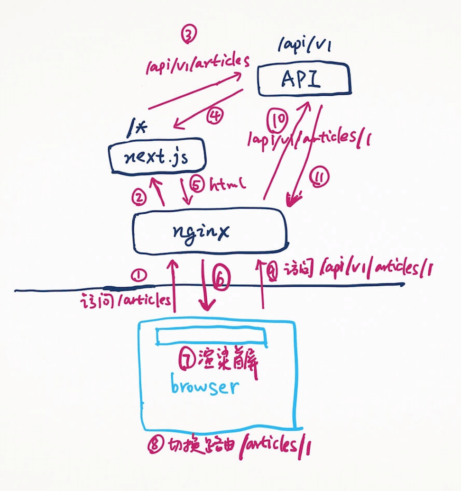
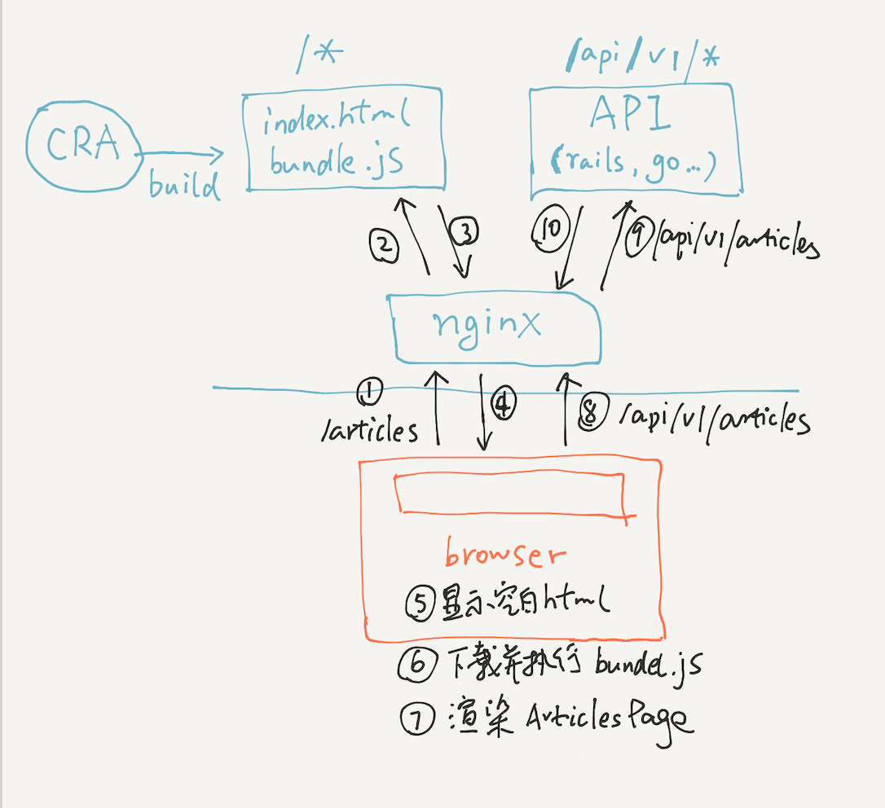
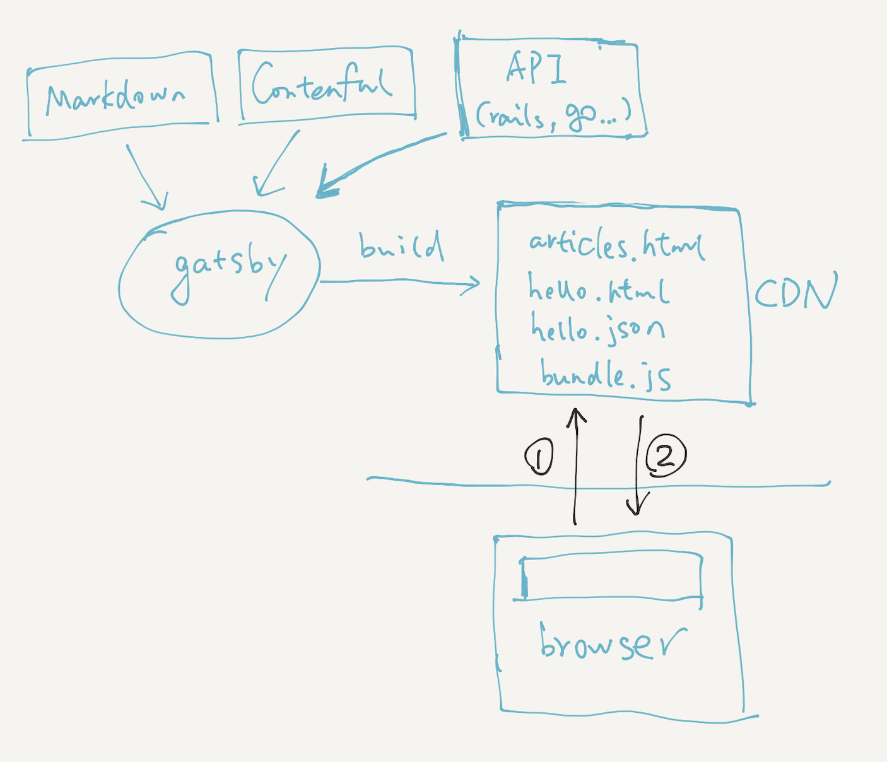

首先来看前提。

基于 React 是因为前端三大框架中我对这个最熟，Angular 没用过，Vue 了解，只写过 demo。

基于前后端分离是因为我相信这是趋势，后端终将只提供 API。之前我也怀疑，也有很多人对前后端分离排斥，因为觉得前后端分离做 SSR 很麻烦，对 SEO 不友好。但自从通过学习 Gatsby 我对 React 上的 SSR 框架 Next.js 有了彻底的理解后，我坚定地站前后端分离这边，因为 SSR 不再是痛点。

SSR 不再成为前后端分离的痛点后，相比前后端一体的优点：

1. 前端和后端解耦合，各自通过切换语言/框架进行重构都互不影响，更加灵活，比如后端，我想从 Rails 切换成 Go，如果是前后端一体，Rails 中的 html 模板和 Go 中的 html 模板并不通用，界面也得全部重写，而如果是前后端分离，我前端从 React 切到 Vue，后端从 Rails 切到 Go，完全相互不影响。
1. 如果同时还要开发 mobile 应用，桌面应用等，不用再重新开发一套 API 服务。
1. 将 UI 的渲染交给客户端处理，服务端专注处理数据，减轻服务端的压力，提升性能。
1. 前端可以使用 mock，不必等待后端的接口，和后端并行开发。
1. 更多...

对于后端，我们可以选择任意自己熟悉的语言和框架，比如 Rails / Go (Gin) / Python (Django) / Java (Spring)...

对于前端，在不同的需求下，我们需要选择不同的 React 框架。以下是我的个人心得总结：

1. 面向终端用户 (最广大的普通用户) 的动态网站
   - 需要考虑 SEO (SSR) - [Next.js](https://nextjs.org/)
   - 不需要考虑 SEO (SSR)，比如 Facebook 这种需要登录才能使用的网站 - CRA (Create React App) ~~或同类框架 (umi)~~
1. 面向终端用户的静态网站 (比如仅用于宣传的官网，文档)
   - 宣传型的官网：[Gatsby](https://www.gatsbyjs.org/) / [Next.js](https://nextjs.org/)
   - 文档站：[Gatsby](https://www.gatsbyjs.org/) / [Docusaurus](https://docusaurus.io/) / [docz](https://www.docz.site/)
1. 面向管理人员的 admin 后台 (完全不需要考虑 SEO)
   - 对 UI 要求低 - ~~无脑上 Ant Design Pro (内置路由/dva/proxy/mock 等一条龙服务)~~ (现在觉得 Ant Design Pro 有点太重了，更倾向用 CRA + Ant Design 自己搭)
   - 对 UI 有要求，要有自己的 style - CRA ~~或同类框架 (umi)~~

配套的一些其它库：

1. 语言 - TypeScript
1. 路由 - next.js / ant design pro / umi 有自己的路由，gatsby 使用了 reach router (reach router 新版本已经和 react router 6.0 合并了)，但使用 CRA 创建 SPA 的话我会推荐使用 react router (reach router 的 SEO 不行，出现问题 google 出来的结果好多是 react router 的页面)
1. 状态管理 - ~~dva (封装了 react router + redux-saga)~~ (现在更倾向不用状态管理)
1. CSS - next.js 使用了 styled-jsx，ant design pro 默认是 css modules，gatsby 教程中推荐使用 emotion ... 总之还是百花齐放，个人偏向 css modules
1. lint + format - ESLint + Prettier
1. UI Playground - Storybook

下面做一些详解。

## 需要 SSR - Next.js

严格地说，Next.js 并不完全是一个前端框架，它也是一个中间渲染层，兼具前端和一部分后端功能，其构架如下所示：

(TODO: 重新画过这个图)

假设这是一个 blog 网站，首页是文章列表 (`/` 和 `/articles` 都是渲染文章列表)，整个工作流程是这样的：

1. 第一步，打开浏览器，访问这个 blog 网站的文章列表页面 (`/` 或者 `/articles`)。
1. 第二步，请求到达服务器的 nginx，nginx 设置的规则是，如果请求匹配 `/api/v1/*`，则转给 API 服务处理，否则如果匹配 `/*`，则转给 next.js 服务处理，所以 `/articles` 请求发送给了 next.js 服务。
1. 第三步到第六步，next.js 收到 `/articles` 请求后，会选择渲染文章列表界面，假如这个 page 叫 ArticleListPage，在这个 component 中，next.js 的 getInitialProps() 方法会去访问 API 服务的 `/api/v1/articles` API，获得所有的 articles 数据 (不考虑分页)，然后渲染出 html，html head 中 link 了 bundle 的所有 js 代码，html 返给浏览器。
1. 第七步，浏览器得到了 html 后，进行首屏渲染，用户马上就看到了内容。浏览器解析完 html 后，会继续下载 html 中 link 的 js 代码并执行，然后该网站就变成了一个 SPA，js 接管剩余的所有路由，并且 js 会把此页面用 js 再重新渲染一遍 (用户没有感知)。
1. 第八步到第九步，用户点击某篇文章查看详情，比如 `/articles/1`，由于 js 在客户端已经接管了路由，所以这个请求并不会发送到服务端的 nginx，js 代码根据路由，切换到详情页面 (比如 ArticlePage) 组件，在这个组件在 getInitialProps() 方法中，它会发送 `/api/v1/articles/1` 的 ajax 请求去访问 API 获取文章的详情数据。
1. 第十步到第十一步，`/api/v1/articles/1` 的请求到达服务端的 nginx 后，转发给 API 服务处理，API 从数据库查询得到结果返回给浏览器，浏览器渲染之。整个流程结束。

从上面可以看出，next.js 在服务端仅负责首屏渲染，剩余的都在客户端进行渲染，只有首次访问的请求会经过服务端的 next.js，剩余所有请求都直接到达 API 服务。

PS: 即使一个网站需要做 SSR，但具体到每个页面，每个页面的每个元素，可能有不同的需求，比如像登录页面，提交反馈界面，就没有必要做 SSR，如果某个页面中的一部分全是个性化推荐的内容，完全也可以不做 SSR。在写 render() 函数时，尽量在服务端少渲染东西，把它们下推到浏览器进行渲染，以减轻服务器压力，提高响应速度和性能。

## 不需要 SSR - CRA / umi / Ant Design Pro

示图：

(TODO: 重新画过这个图)

不需要太多解释，典型的 SPA，大家对这个再熟悉不过了。

CRA build 后，得到空白 body 的 index.html 和 bundle.js (不考虑 split) 静态文件，浏览器首次访问任何页面，得到的同一个 index.html，然后下载 index.html 中 link 的 bundle.js 并执行，js 在客户端这边接管剩余路由，用 js 渲染相应的页面，在不同的页面通过 ajax 请求访问不同的 API。

## 静态网站 - Gatsby

示图：

(TODO: 重新画过这个图)

工作流程：

1. gatsby 从各处数据源获取数据，build 后一次性生成所有静态页面，包括 html / json / bundle.js，一个页面就有一个 html 和 json，比如 articles.html / articles-$hash.json, hello.html / hello-$hash.json，然后把这些静态文件扔到 CDN 上即可 (比如 netlify)
1. 浏览器首次访问某个页面，比如 `/articles`，则得到的是 `/articles.html`，如果是 `/hello`，则得到的是 `/hello.html`，假定这里我访问的是 `/articles`。
1. 每个 html 的 head 都 link 了 bundle.js (实际做了 split，拆成了很多个 js，这里做简化处理)，浏览器解析并渲染 html 后，下载并执行 bundle.js，接管所有剩余路由。
1. 接下来就是 gatsby 相比 jekyll/hugo 这些静态建站工具的特别之处了，如果此时我点击某篇文章的详情，假如是 `/hello`，jekyll/hugo 会去 CDN 访问相应的 html 文件，但 gatsby 不会，前面说到，它会在客户端这边接管所有剩余的路由，因此 gatsby 会根据 `/hello` 路由在客户端这边用 js 渲染相应的页面，那数据来自何处，前面说到每一个 html 都有一个相应的 json 文件，json 文件存储的就是各页面对应的数据，因此 gatsby 在客户端渲染不同的页面时，会通过 ajax 请求去取相应的 json 文件，取回来后解析成 object 做为各个 compoment 的 props。详细的分析看这篇文章 - [gatsby 是如何做到无刷新的页面跳转以及瞬间加载](https://baurine.netlify.com/2019/06/05/why-gatsby-blazing-fast/)

PS: 以上仅个人拙见，很多表述做了简化处理，跟实际工作流程不一定完全相符，但整体的原理是没有太大偏差的。
