阅读前提：了解 Prometheus + Grafana 这一套监控系统并有相关实践经验。

## 介绍

grafana 是一套监控数据的可视化工具，它支持任意数据源 (datasource) 和任意展现形式 (panel)，具有极强的扩展性，而支撑它的这种扩展性的就是它的插件机制，它允许第三方开发者来实现自定义的数据源和 panel。


grafana 虽然已经内置了几种图表，以及社区提供了数十个图表插件，足以满足日常大部分的需求，但如果遇到一些特殊需求时，我们就需要自己来实现了。

所以我们来学习一下如何写一个 grafana 的 panel plugin。这里要吐个槽，grafana 关于插件部分的文档实在是太烂了，语焉不详，缺少关键细节，这是学习的主要障碍；而且官方已经逐渐用 react 重构，但几乎所有文档和第三方插件都还停留在 angular 1.x (是 1.x 哦)，对 angular 不熟的人也造成了一点困难 (比如说我)。文档不行，那就只能看代码了 (开源的好处啊)，通过下载调试别人写的插件，再加上一些猜测求证，最后终于大致搞明白了。把这个过程记录下来，方便自己也方便他人。

最后的效果:


<iframe width="560" height="315" src="https://www.youtube.com/embed/kJsZy8M5eNU" frameborder="0" allow="accelerometer; autoplay; encrypted-media; gyroscope; picture-in-picture" allowfullscreen></iframe>

[项目代码](https://github.com/baurine/my-simple-panel)

## grafana 的架构及 plugin 系统

我们先来看一下 grafana 的架构，虽然 grafana 主要是专注在前端展示，但它也是有后端部分的，后端部分用来实现用户登录系统，存储各种配置，以及从真正的数据源获取数据。前端部分主要分两大块，一部分是 datasource，用来配置数据源，另一部分就是今天的重点 - panel，用来展示数据。

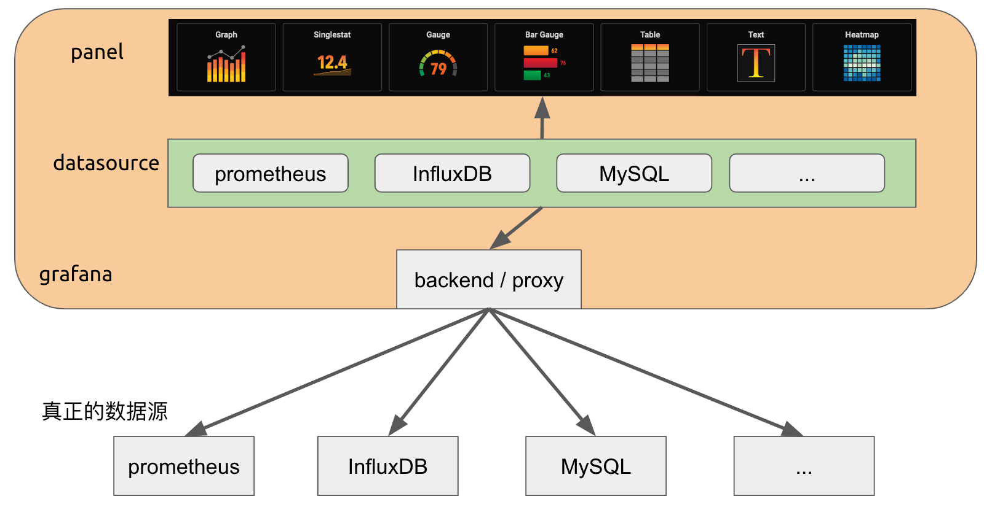

grafana 的目标是支持任意数据源及任意展现形式，显然它不太可能全部由自己来实现。通过插件机制，grafana 将它们的实现开放给数据源提供厂商及开发者，使系统具有了强大的扩展性。

plugin 的一般工作方式：

- 向系统或框架注册 (一般通过声明文件，比如 manifest.json)
- 实现系统或框架约定的接口
- 系统或框架在合适的时机主动调用 plugin 实现的约定接口

其实我们平时说的插件，一般是指一个工具或框架的插件，比如 grafana, chrome, vs-code, wepback, babel... 这是狭义的插件，从广义地来说，平时我们写的 android/iOS/windows 上的 APP，也可以算是某种插件，只不过是操作系统的插件，正是 OS 开放了 API，提供了 SDK，我们才能在其之上进行无限的扩展。

所以，如果你想让你的系统或框架具有很强的扩展性，你就需要为其设计一个插件系统。

grafana 的插件有三种：

- datasource: 数据的生产者。定义数据从何获处，如何获取，交给系统获取原始数据后，将其转换成统一的格式，再由系统传递到 panel 显示
- panel: 数据的消费者。从 datasource 处获得约定格式的数据进行展示
- app: datasource + panel

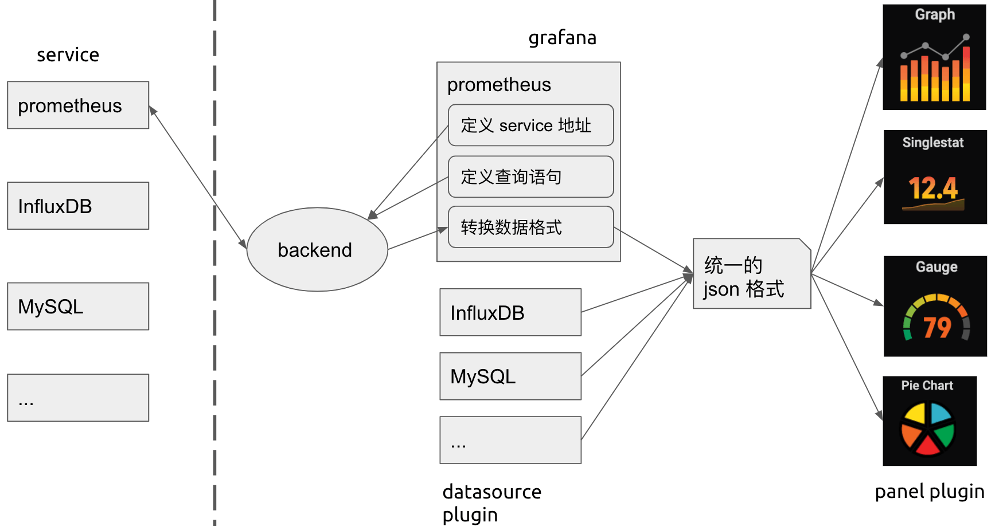

### datasource plugin

我们先来简单地看一下 datasource plugin 长啥样，如何工作。

我们首先来添加一个 datasource，当我们安装了某个 datasource plugin 后，它就会出现在这个列表中，列表中的图标，名字，描述都是在 plugin 的描述文件 (plugin.json) 中声明的。grafana 内置了常见的 datasource plugin，比如 Prometheus，InfluxDB 等。

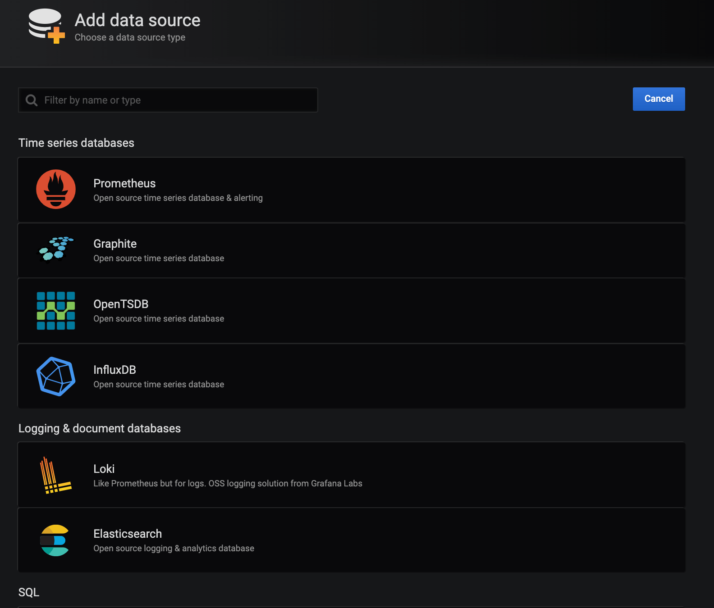

选中一个 datasource 后，我们进入它的设置界面，在这个设置界面中，我们一般用来设置该 datasource 的 service url，以及 auth 方式，因为不同的 datasource 有不同的设置，所以不同的 datasource 这个界面是不一样的，由开发者在 plugin 中实现。比如下面是 Prometheus 和 MySQL 的设置界面。

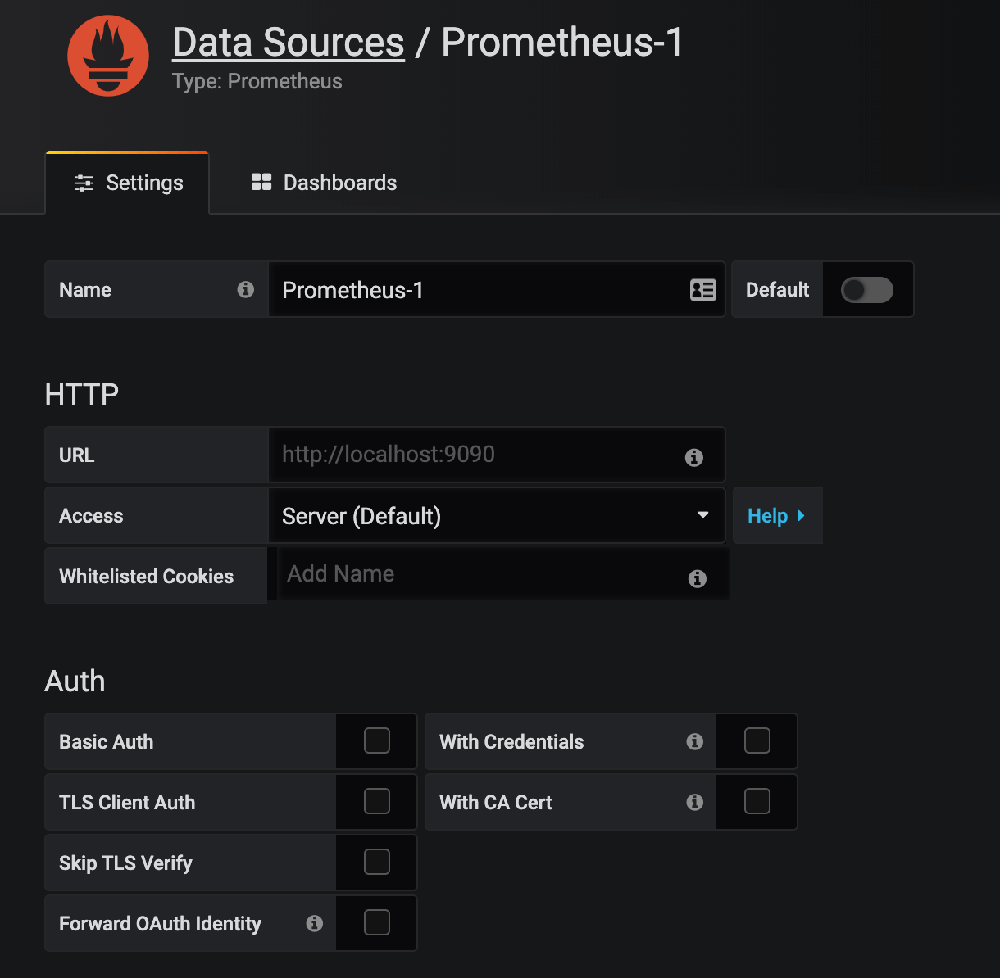

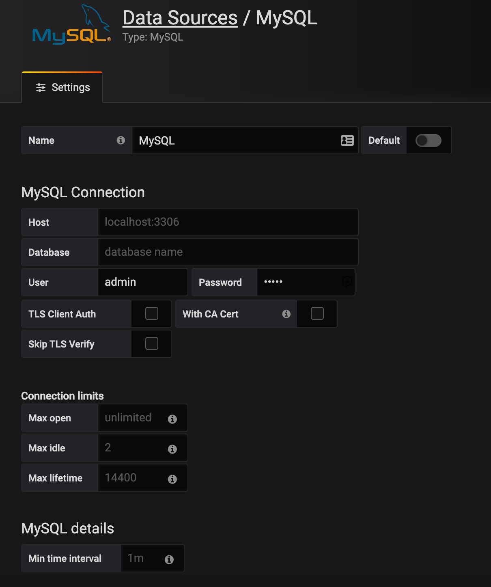

添加 datasource 后，我们就可以在 dashboard 的 panel 中选择此 datasource，此时就会出现它的查询语句编辑框，因为不同的数据源有不同的查询语法，所以这部分也是由各个 datasource plugin 自己来实现的。


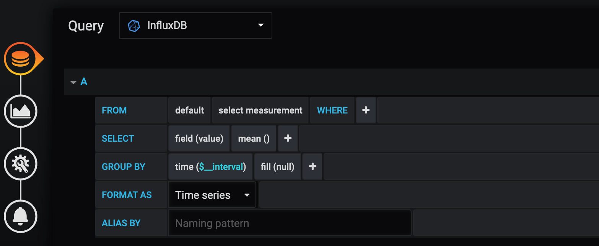

填写查询语句后，datasource plugin 将会请求 grafana 的后端，同时带上刚填写的查询语句作为参数，grafana 接受请求后，它以代理的工作形式去请求真正的数据源 (可以避免跨域的问题)，然后将获得的数据再返回给前端的 datasource plugin。因为不同的数据源的格式是不一样的，datasource plugin 需要将这些不同的格式进行转换，然后输出成相同的 json 格式。grafana 定义了两种输出格式，一种是 time series，一种是 table。datasource plugin 需要在输出的 json 中表明自己是哪一种格式。

time series 格式的 json 长这样：

```json
[
  {
    "target": "upper_75",
    "datapoints": [
      [622, 1450754160000],
      [365, 1450754220000]
    ]
  },
  {
    "target": "upper_90",
    "datapoints": [
      [861, 1450754160000],
      [767, 1450754220000]
    ]
  }
]
```

table 格式的 json 长这样：

```json
[
  {
    "columns": [
      {
        "text": "Time",
        "type": "time",
        "sort": true,
        "desc": true
      },
      {
        "text": "mean"
      },
      {
        "text": "sum"
      }
    ],
    "rows": [
      [1457425380000, null, null],
      [1457425370000, 1002.76215352, 1002.76215352]
    ],
    "type": "table"
  }
]
```

从上面可以看出，实际只有 table 格式的 json 中用 `type: "table"` 声明了自己是 table 格式，如果没有 type 字段，则是 time series 格式。(我猜测一开始只有 time series 一种格式，后来才加了 table 格式，为了保持向后兼容，所以没有给 time seires 加上 type 字段。)

总结一下 datasource plugin 的主要工作：

1. 实现定义 service url 及 auth 方式的界面
1. 实现查询语句编辑框界面
1. 将查询语句作为参数请求 grafana 后端去从真正的数据源获取数据，然后将得到的数据进行格式转换并输出

### panel plugin

然后我们再来看一下 panel plugin 长啥样。

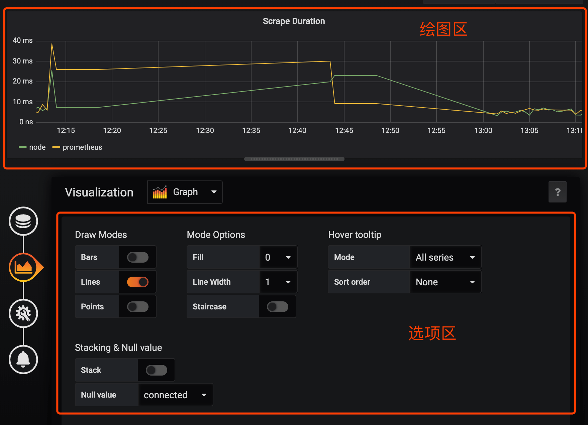

从上图可以看出，panel plugin 主要由两部分组成：

- 绘图区
- 选项区：控制绘图的参数，比如线条的粗细，legend 的位置，数值的单位...

### app plugin

至于 app plugin，我没有仔细看文档，这里只是我的猜测，有可能并不正确。

有了 datasource plugin 和 panel plugin，为什么还需要 app plugin 呢。从上面的架构图可以看出，因为 datasource plugin 和 panel plugin 独立存在时，它们是解耦的，因此必须约定一种相同的数据格式来通信，然而 grafana 只定义了两种数据格式且比较简单，如果这两种数据格式都不能满足需求，那就要通过 app plugin 来实现了，在 app plugin 中，datasource 和 panel bundle 在一起，是耦合的，所以你可以让 datasource 输出任意数据格式，而相应的 panel 知道要处理的是这种数据格式。

## 实现 panel plugin

### 搭建环境

开始之前我们先把开发环境搭建起来。

1. 把 node_exporter (可选) 和 prometheus 跑起来
1. 把 grafana 跑起来
1. 添加 prometheus 数据源和导入预定义的 dashboard
1. 配置 grafana 的插件目录
1. 在插件目录下 clone 官方插件模板

#### 1. 运行 node_exporter 和 prometheus

首先我们去 prometheus 的官网下载 [node_exporter](https://prometheus.io/download/#node_exporter)，解压后运行 `./node_exporter`，它向 prometheus 暴露了 http://localhost:9100/metrics 接口。(这一步可选)

然后下载 [prometheus](https://prometheus.io/download/#prometheus)，解压后，修改目录中的 promethues.yml 配置文件，声明添加一个抓取任务 (如果没有执行上一步，即运行 node_exporter，则 prometheus.yml 无须修改)，如下所示：

```yml
scrape_configs:
  # default
  - job_name: "prometheus"
    static_configs:
      - targets: ["localhost:9090"]

  # new
  - job_name: "node"
    static_configs:
      - targets: ["localhost:9100"]
```

运行 `./promethues`，可以通过 http://localhost:9090 访问 prometheus 自带的简陋 web ui。

#### 2. 运行 grafana

接下来我们安装 grafana (当前版本 v6.3.5) 并把它运行起来，在 macOS 上我们通过 brew 来安装，并通过 brew services 控制 grafana 的启动和停止。

```shell
$ brew install grafana
$ brew services start|stop|restart grafana
```

把 grafana 跑起来后，我们可以在浏览器中通过 http://localhost:3000 来访问它了。初次访问，要求输入用户名和密码，默认是 admin/admin。

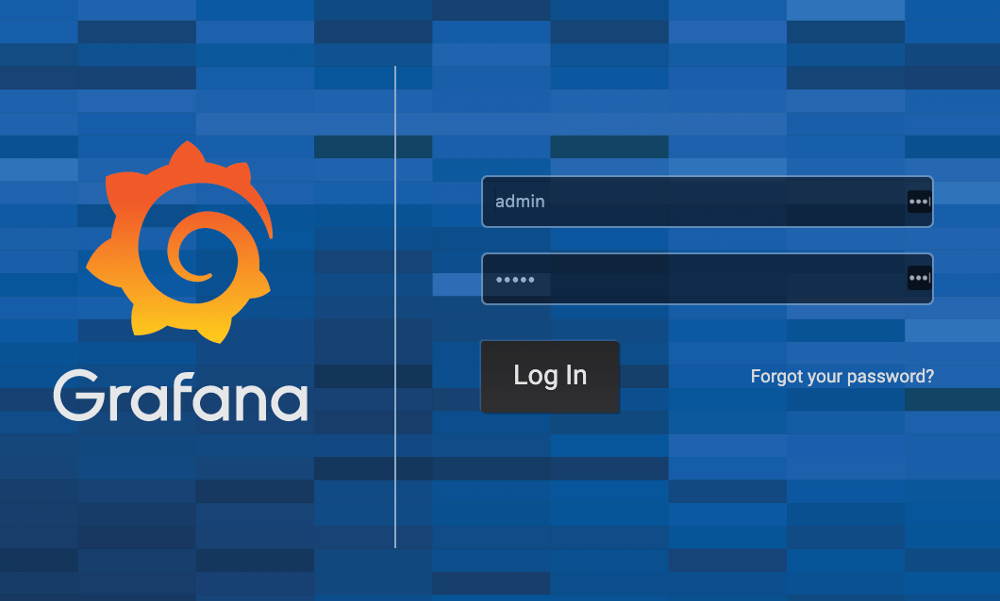

#### 3. 添加 data source 和导入 dashboard

初次进入主界面，啥都没有，我们按照提示，先来添加一个 data source，再添加一个 dashboard。

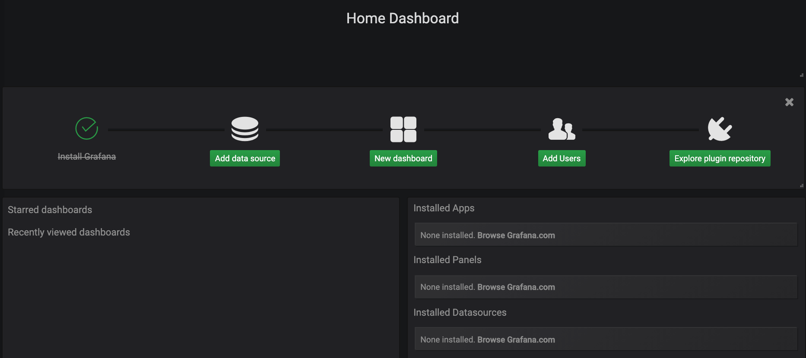

点击 "Add data source"，在 data source 列表中选择 Prometheus，在设置界面，service url 使用 "http://localhost:9090" ，其余默认，然后点击 "Save & Test"，如果能正确连接上 Prometheus，会提示 "Data source is working"，否则提示 "HTTP Error Bad Gateway" 或其它错误。


然后回到主界面，点击 "New dashboard"，就可以自行添加各种 panel 了，为了快速演示效果，我们来添加一些 grafana 已经定义好的 dashboard。在 Prometheus data source 的设置界面，点击 dashboard tab，这里有一些为这个 data source 预设的一些 dashboard，我们选择 "Prometheus 2.0 Stats" 进行导入。


回到首页，选择 "Prometheus 2.0 Stats"，就可以看到如下的监控图了。


#### 4. 配置 grafana 的插件目录

万事俱备，我们就可以开始着手开发 panel 插件了，开发环境下这个插件要放到哪呢? 根据文档，grafana 有一个配置文件，位于 `/usr/local/etc/grafana/grafana.ini`，在这个配置文件中设置了默认的插件路径是 `/var/lib/grafana/plugins`，因为这是系统目录，存在权限问题，为了开发方便，我们把它修改成我们自己的工作目录。

```ini
# Directory where grafana will automatically scan and look for plugins
;plugins = /var/lib/grafana/plugins
plugins = /Users/myname/my-workspace/grafana-plugins
```

注意，修改配置后要重启 grafana 服务才能生效，执行 `brew services restart grafana`。

#### 5. clone 官方模板

然后我们进入插件目录，先 git clone 一个官方模板工程，在它的基础上进行开发。鉴于文档和示例插件大部分还是 angular 版本，我们还是基于 angular 来开发，后续再研究 react 版本。

```shell
$ git clone git@github.com:grafana/simple-angular-panel.git
```

进入项目根目录，执行 `yarn` 安装依赖，再执行 `yarn run watch` (通过 package.json 可以获知此命令) 以 watch 模式把插件运行起来，这样修改插件后，会自动重新编译插件，刷新浏览器就能重新加载新的插件。

刷新浏览器，在首页发现 "Installed Panels" 中出现了 "Simple Angular"。(如果没有的话，尝试重启一下 grafana 服务)

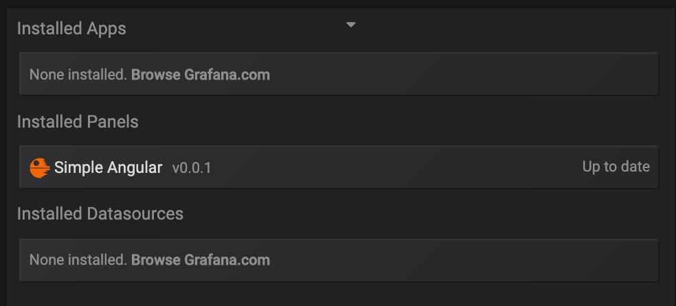

然后在 "Prometheus 2.0 Stats" dashboard 中选择一个 panel，比如 "Scrape Duration"，进入它的编辑模式，重新选择图表类型，在图表类型中选择刚安装的 "Simple Angular"，绘图区出现了熟悉的 "Hello World"。

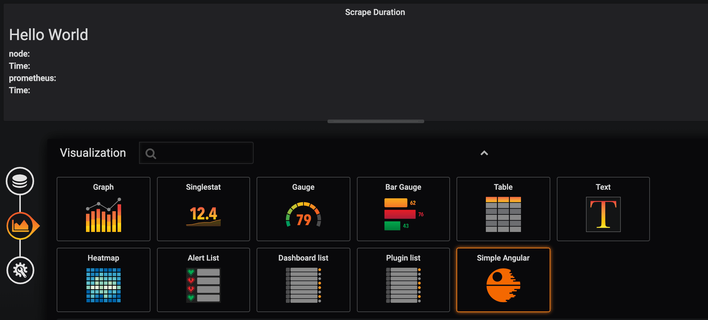

至此，一个最简单的插件就跑起来了，而我们的任务就是，在绘图区按我们自己的方式，模仿内置的 Graph 图表，把数据绘制出来。

### 修改 manifest

再来回顾一下 plugin 的工作方式：

- 向系统或框架注册 (一般通过声明文件，比如 manifest.json)
- 实现系统或框架约定的接口
- 系统或框架在合适的时机主动调用 plugin 实现的约定接口

第一步是通过声明文件向系统或框架注册，grafana 约定的声明文件为 src/plugin.json。在这个声明文件中，我们需要声明插件的类型 (panel | datasource | app)，插件名字，插件 id (必须唯一，不能和其它插件相同)，及其它一些信息，比如图标，作者，描述，依赖的 grafana 版本等等。我们把它稍做修改。

```json
{
  "type": "panel",
  "name": "My Panel",
  "id": "my-simple-panel",

  "info": {
    "description": "My Custom Simple Panel"
    // ...
  }
}
```

修改声明文件后，要重启 grafana 才能生效，如下所示：

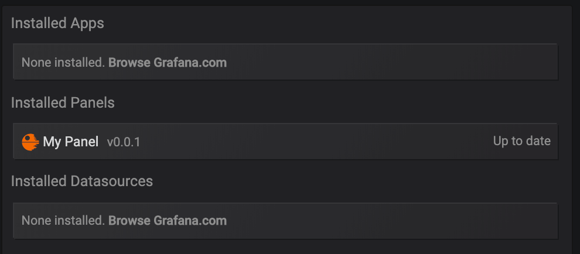

### 实现接口

第二步，实现系统或框架约定的接口。grafana 为 panel 插件约定了两类接口：

- PanelCtrl 类：用于实现不需要从 data source 获取数据的 panel，比如显示当前时间，倒计时之类的，意义不大，可忽略，因为用后面的 MetricPanelCtrl 也可以实现。
- MetricPanelCtrl 类：继承自 PanelCtrl 类，用于实现需要从 data source 获取数据的 panel。

很显然我们要实现 MetricPanelCtrl 类。grafana 约定的入口是 src/module.ts，在这个文件中我们需要实现一个 MetricPanelCtrl 的继承类并把它导出。

```ts
// module.ts
import { MetricsPanelCtrl } from "grafana/app/plugins/sdk";
class MyPanelCtrl extends MetricsPanelCtrl {
  // 实现代码
}
export { MyPanelCtrl as PanelCtrl };
```

在实现代码中我们要做哪些事情呢，其实非常简单：

1. 接收 data source 获取的数据
1. 配置绘图参数
1. 将数据显示在绘图区

我们一步一步来实现。

#### 1. 接收数据

(这里面有个坑，后面会说到)

通过在 MyPanelCtrl 的构造函数中监听 "data-received" 事件来接收数据。

```ts
class MyPanelCtrl extends MetricsPanelCtrl {
  /** @ngInject */
  constructor($scope, $injector) {
    super($scope, $injector);

    this.events.on("data-received", this.onDataReceived.bind(this));
    // ...
  }

  onDataReceived(dataList: any) {
    console.log("onDataReceived:", dataList);
    // ...
  }
}
```

通过 log 发现接收到的数据格式和前面所说的 time series 格式确实是一致的。

```json
[
  {
    "datapoints": [...],
    "target": "..."
  },
  {
    "datapoints": [...],
    "target": "..."
  }
]
```

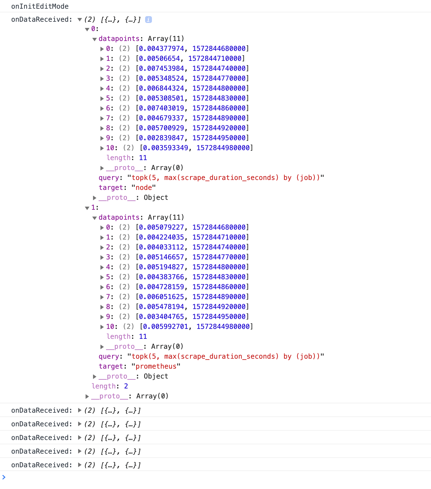

虽然所有文档都是说这么接收数据，但我们打开刚下载的官方模板代码一看，却是另一种实现：

```ts
constructor($scope, $injector) {
  super($scope, $injector);
  (this as any).dataFormat = 'series';
  // ...
}
// 6.3+ get typed DataFrame directly
handleDataFrame(data: DataFrame[]) {
  console.log('handleDataFrame', data);
  // ...
}
```

从注释来看，这是从 6.3 版本后定义的新接口及新的数据格式 - DataFrame，鉴于还没有任何有关这部分内容的文档，我们还是采用旧的实现方式，需要把上面这部分代码删掉，或者只删除 `(this as any).dataFormat = 'series';` 这一行也行。因为在 grafana 的源码中我们发现逻辑是这样的：

```ts
// metrics_panel_ctrl.ts
if (this.useDataFrames) {
  this.handleDataFrames(data.series);
} else {
  // Make the results look as if they came directly from a <6.2 datasource request
  const legacy = data.series.map(v => toLegacyResponseData(v));
  this.handleQueryResult({ data: legacy });
}
```

如果声明了使用 useDataFrames，接收到数据后则调用 handleDataFrames() 接口，否则，将数据转换回老的格式，调用老的接口。

#### 1. 接收数据 - 加工数据

接收到数据后，如果我们有对数据进行统计求最大值，最小值，平均值的需求，可以使用 grafana 提供的一个工具类 - TimeSeries。

```ts
onDataReceived(dataList: any) {
  console.log('onDataReceived:', dataList);
  this.data = dataList.map(this.seriesHandler.bind(this));
  console.log('onDataReceived series:', this.data);

  this.render();
}

seriesHandler(seriesData: any) {
  const series = new TimeSeries({
    datapoints: seriesData.datapoints,
    alias: seriesData.target,
  });
  series.flotpairs = series.getFlotPairs('connected');
  return series;
}
```

`this.render()` 之后会解释，`series.getFlotPairs('connected');` 用来统计最大值，最小值，平均值等，参数 'connected' 我推测是用来说明如何处理数据中的 null 值，'connected' 表示会根据它前后的值对它进行插值计算，而不是处理成 0。

从 log 来看，转换后的数据多了很多属性，其中最重要的就是 flotpairs 和 stats 字段。

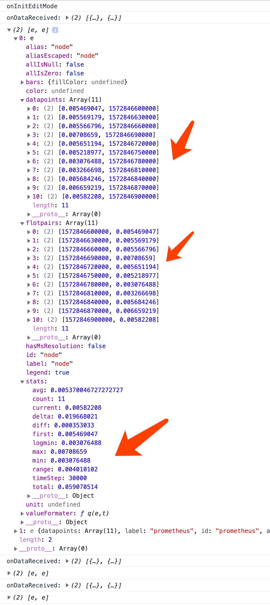

#### 2. 配置绘图参数

接下来我们来实现插件的绘图参数选项区。步骤如下：

1. 在 js 中声明选项变量，比如 lineWidth, showPoints, pointRadius
1. 监听 'init-edit-mode' 事件
1. 在事件处理函数中调用 addEditorTab() 加载显示 html
1. 在 html 里用 input 显示各个选项，此 html 会显示在 panel 的选项区

选项变量和 html 中的值因为使用了 angular 进行双向绑定，所以在 html 修改选项会立即修改 js 中的选项变量值，不需要我们手动操作。

#### 2. 配置绘图参数 - 在 js 中声明选项变量

```ts
class MyPanelCtrl extends MetricsPanelCtrl {
  panelDefaults = {
    lineWidth: 2,
    showPoints: true,
    pointRadius: 4
  };

  /** @ngInject */
  constructor($scope, $injector) {
    super($scope, $injector);
    defaultsDeep(this.panel, this.panelDefaults);
    // ...
  }
  // ...
}
```

#### 2. 配置绘图参数 - 监听 'init-edit-mode' 加载 html

```ts
constructor($scope, $injector) {
  super($scope, $injector);
  // ...
  this.events.on('init-edit-mode', this.onInitEditMode.bind(this));
}

onInitEditMode() {
  console.log('onInitEditMode');
  this.addEditorTab('Panel Options', `public/plugins/${this.pluginId}/partials/options.html`, 2);
}
```

#### 2. 配置绘图参数 - 实现 options.html

这里稍微有一些 angular 的知识在里面，不过都很好理解。class 都是 grafana 内置的，照着模板来修改就行了。`ctrl.render()` 之后会解释。

```html
<div class="editor-row">
  <div class="section gf-form-group">
    <h5 class="section-heading">Draw Options</h5>
    <div class="gf-form">
      <label class="gf-form-label width-9">Line Width</label>
      <div class="gf-form-select-wrapper max-width-9">
        <select
          class="gf-form-input"
          ng-model="ctrl.panel.lineWidth"
          ng-options="f for f in [0,1,2,3,4,5,6,7,8,9,10]"
          ng-change="ctrl.render()"
        ></select>
      </div>
    </div>
    <gf-form-switch
      class="gf-form"
      label="Points"
      label-class="width-9"
      checked="ctrl.panel.showPoints"
      on-change="ctrl.render()"
    ></gf-form-switch>
    <div class="gf-form" ng-if="ctrl.panel.showPoints">
      <label class="gf-form-label width-9">Point Radius</label>
      <div class="gf-form-select-wrapper max-width-9">
        <select
          class="gf-form-input"
          ng-model="ctrl.panel.pointRadius"
          ng-options="f for f in [1,2,3,4,5,6,7,8,9,10]"
          ng-change="ctrl.render()"
        ></select>
      </div>
    </div>
  </div>
</div>
```

最后，当我们选择 My Panel 后，选项区是长这样：


#### 2. 配置绘图参数 - 单位换算

这里再做一下扩展。因为我们拿到的数据都是纯数值，没有单位，但在显示的时候，不同的情况下要显示不同的单位，而且要对数值进行某些换算，比如在 "Scrape Duration" 这个 panel 中，某个时间我们得到的值是 0.007，默认单位是 second，但在图表中，我们要把它显示成更合适的 7ms，而不是原始的 0.007；再比如对网络流量的监控，那 y 轴显示的数值应该是 kbps/mbps 之类。

y 轴应该以什么形式显示数值很明显属于绘图参数，可以放到 options.html 中。grafana 内部实现了很多单位格式及其换算函数，我们可以直接拿来用。

首先我们在 js 中获取所有单位格式，声明单位变量及相关函数。

```ts
// 新的实现
// grafana 主仓库里这两个方法是在 @grafana/data 里，估计 6.4 以后要从 '@grafana/data' 中导入
import { getValueFormats, getValueFormat } from "@grafana/ui";
// 老的实现
import kbn from "grafana/app/core/utils/kbn";

class MyPanelCtrl extends MetricsPanelCtrl {
  panelDefaults = {
    // ...

    curUnitFormat: "s"
  };
  // 存储所有单位格式
  unitFormats: any;

  // ...
  onInitEditMode() {
    console.log("onInitEditMode");

    // 下面两者等价
    console.log("kbn.getUnitFormats():", kbn.getUnitFormats());
    console.log("getValueFormats:", getValueFormats());

    // 获取所有单位，用来在 options.html 中显示
    // https://github.com/grafana/piechart-panel/blob/master/src/piechart_ctrl.ts#L61
    // this.unitFormats = kbn.getUnitFormats();
    this.unitFormats = getValueFormats();

    this.addEditorTab(
      "Panel Options",
      `public/plugins/${this.pluginId}/partials/options.html`,
      2
    );
  }

  // 在 options.html 中会用到此函数
  setUnitFormat(subItem: any) {
    console.log("setUnitFormat:", subItem);

    this.panel.curUnitFormat = subItem.value;
    this.render();
  }

  // 单位换算，在后面绘图时要用到这个函数
  formatValue(value: any) {
    // getDecimalsForValue() 具体实现看源码吧
    // 大致是用来计算该保留几位小数点合适，具体算法我也还没太整明白
    const decimalInfo = this.getDecimalsForValue(value);
    // 获取当前单位对应的转换函数
    // const formatFunc = kbn.valueFormats[this.panel.curUnitFormat];
    const formatFunc = getValueFormat(this.panel.curUnitFormat);
    if (formatFunc) {
      return formatFunc(
        value,
        decimalInfo.decimals,
        decimalInfo.scaledDecimals
      );
    }
    return value;
  }
}
```

然后在 options.html 增加单位选择器。

```html
<div class="editor-row">
  <!-- ... -->
  <div class="section gf-form-group">
    <h5 class="section-heading">Axes</h5>
    <div class="gf-form">
      <label class="gf-form-label width-8">Unit</label>
      <div
        class="gf-form-dropdown-typeahead width-10"
        ng-model="ctrl.panel.curUnitFormat"
        dropdown-typeahead="ctrl.unitFormats"
        dropdown-typeahead-on-select="ctrl.setUnitFormat($subItem)"
      ></div>
    </div>
  </div>
</div>
```

新的选项区：


#### 3. 绘图

数据拿到了，绘图参数也配置好了，接下来我们就可以开始最核心的绘图了。但坑的是，最关键的绘图操作，居然没有哪个文档说明应该在哪个接口中进行绘图。

只好看别人实现的代码了，看了几个别人写的 plugin 后，发现代码中都有一个 link() 函数，在这个函数中进行 DOM 的操作，但 grafana 的文档完全没有提及这个函数，后来搜索了一下发现这个是 angular 中的函数，我理解它类似 React 中的 onComponentDidMount() 生命周期函数，只有在这个函数中才可以操作 DOM。

总结了一下它们的套路是这样的：

1. 定义一个 html 作为绘图区，里面可以只放一个 div 作为绘图区的容器。
1. 实现 link() 函数，在 link() 函数注册监听 'render' event，在它的事件处理函数中，可以获得绘图区的容器节点，然后在这个容器中进行绘制，可以随便用什么工具，比如 d3 啊，echarts 啊，可以用 canvas 也可以用 svg 绘制，自由度很大。
1. 任何时候需要绘图区进行重绘时，比如接收到新数据，修改了选项区的参数，都需要显式地调用一下 this.render() 方法，它唯一的作用就是发射 'render' event，通知所有此事件的观察者，可以进行重绘了。

上面第 2 和第 3 步完全没有文档提及，简直气人。

#### 3. 绘图 - 定义 module.html 作为绘图区

```ts
// module.ts
class MyPanelCtrl extends MetricsPanelCtrl {
  // 声明绘图区 html
  static templateUrl = "partials/module.html";
  // ...
}
```

在绘图区 html 放置一个根结点作为容器就行。

```html
<!-- partials/module.html -->
<div id="panel_svg_container" style="height: 100%;"></div>
```

#### 3. 绘图 - 实现 link() 函数，监听 'render' event

```ts
// ctrl 表示 MyPanelCtrl 实例
link(scope: any, elem: any, attrs: any, ctrl: any) {
  console.log('link');

  ctrl.events.on('render', function() {
    console.log('link render handler');

    if (ctrl.data.length > 0) {
      ctrl.drawLines(ctrl.data);  // drawLines() 在下一步实现
    }

    // 没什么实际用处，只用于 grafana 统计该 panel 绘制了多少次
    ctrl.renderingCompleted();
  });
}
```

#### 3. 绘图 - 实现绘图逻辑

这里我们选择用 d3 和 svg 来绘图，仅做示例。实际官方实现的 panel 都是用 canvas 绘制的，可能是考虑到一个 dashboard 里可能同时渲染数十或者更多个 panel，如果用 svg 来绘制的话，会生成很多很多 DOM 元素，影响性能。(猜测)

d3 库是直接下载了 d3.v5.min.js 放到项目的 lib 目录下。具体的绘制看源码实现吧，关键是我们已经把整个流程打通了。

```ts
import * as d3 from './lib/d3.v5.min.js';

drawLines(data) {
  var container = d3.select('#panel_svg_container');
  // ...
  container.select('svg').remove();
  var svg = container
    .append('svg')
    .attr('width', width + 'px')
    .attr('height', height + 'px');
  // ...
  svg.append('g').append('path').attr('stroke-width', this.panel.lineWidth)....
}
```

#### 3. 绘图 - 需要重绘时调用 this.render()

```ts
onDataReceived(dataList: any) {
  console.log('onDataReceived:', dataList);
  this.data = dataList.map(this.seriesHandler.bind(this));
  console.log('onDataReceived series:', this.series);

  this.render();  // 必须! 发出 'render' event，触发重绘
}
```

修改选项区选项时，也可以通过显式调用 ctrl.render() 函数触发重绘。

```html
<select
  class="gf-form-input"
  ng-model="ctrl.panel.lineWidth"
  ng-options="f for f in [0,1,2,3,4,5,6,7,8,9,10]"
  ng-change="ctrl.render()"
></select>
```

再次展示最后的成果：


#### 其它

文档里还提及了其它一些 event，但我觉得不处理也没关系，取决你自己的需求：

- data-error: 处理数据获取失败的情况，一般的处理情况就是清空 this.data
- data-snapshot-load: 处理以 snapshot 模式加载数据情况 (暂时还没理解 snpashot mode 是怎么触发的)，如果非要处理的话，和 data-received 共用一个处理函数就行
- panel-teardown: 处理 panel 被卸载 (比如被折叠起来的时候?) 时的清理工作，一般是用了定时器才需要清理

## TODOs

1. 探索 React 实现
1. 探索 data source plugin 的实现

## 参考

1. [Writing the Clock Panel Plugin for Grafana 3.0](https://grafana.com/blog/2016/04/08/timing-is-everything.-writing-the-clock-panel-plugin-for-grafana-3.0/)
1. [piechart-panel](https://github.com/grafana/piechart-panel/blob/master/src/piechart_ctrl.ts)
1. [grafana-gauge-panel](https://github.com/briangann/grafana-gauge-panel/blob/master/src/ctrl.js)
1. [bubblechart-panel](https://github.com/digrich/bubblechart-panel/blob/master/src/bubble_ctrl.js)
