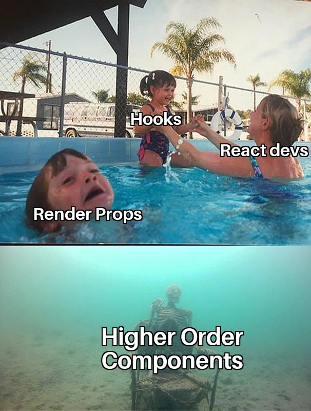
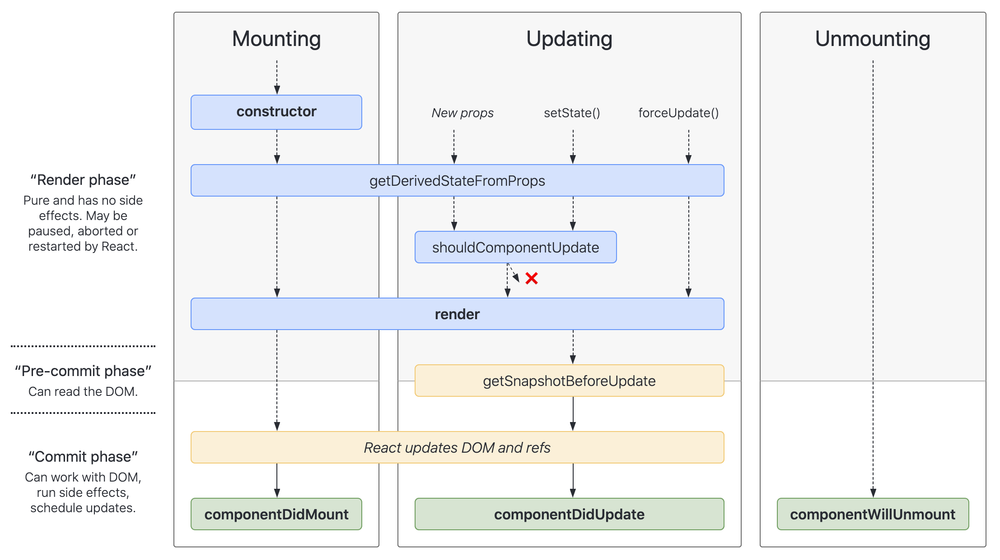
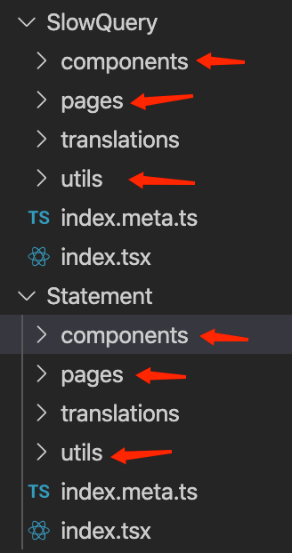

最近在公司前端组做了一次关于 react hooks 的简单分享，本文是对分享内容的整理。

主要分了三块讲：

- Why
- What
- How

## Part 1 - Why

先来看一张我在 twitter 上看到的一张图片：



react hooks 一经发布，就迅速流行，并取代了 HOC 和 render props 两种 react pattern。这说明 react hooks 为我们解决了一些痛点问题，那么这些痛点是什么呢。

我们先来看一下在 hooks 之前人们在用 react 时常抱怨的一些问题。

1. 存在两种组件，Function 组件 (纯函数，无状态) 及 class 组件。当需要往 Function 组件中加入状态时，需要完全改写成 class 组件，修改大。
1. class 组件：生命周期函数多 (头大)
1. class 组件：this 指针问题 (需要使用一堆 bind，或是箭头函数)
1. class 组件：经常需要在不同的生命周期中写重复代码，比如 componentDidMounted 和 componentDidUpdate
1. ...

还有最重要的，组件之间很难复用状态逻辑，因为会被生命周期函数所割裂。

所谓的状态逻辑，就是管理状态的逻辑，比如很多组件都有 loading 状态。组件在初始化的 loading 状态先置为 true，然后去获取数据，待取回数据成功或失败后，将 loading 置为 false。

但就是 loading 这样简单的状态管理，在 react 中我们都很难把它的管理逻辑抽取成独立的函数或 class 来在组件间进行复用。因为 loading 值的改变和组件的生命周期强相关。它要在 componentDidMounted 中置为 true，然后执行某种异步操作，根据结果再将 loading 的值置为 false。因为和生命周期绑在了一起，而只有组件才有生命周期，导致它们只能依附于组件中。

这是 [class 组件完整的生命周期](https://projects.wojtekmaj.pl/react-lifecycle-methods-diagram/)：



像 getDerivedStateFromProps() 和 getSnapshotBeforeUpdate() 其实很少人能搞懂到底啥时用，怎么用。

再看一个官方提供的需要在不同的生命周期中写重复代码的示例：

```jsx
componentDidMount() {
  ChatAPI.subscribeToFriendStatus(
    this.props.friend.id,
    this.handleStatusChange
  );
}

componentDidUpdate(prevProps) {
  // unscribe from the previous friend.id
  ChatAPI.unsubscribeFromFriendStatus(
    prevProps.friend.id,
    this.handleStatusChange
  );
  //subscribe to the next friend.id
  ChatAPI.subscribeToFriendStatsu(
    this.props.friend.id,
    this.handleStatusChange
  );
}

componentWillUnmount() {
  ChatAPI.unsubscribeFromFriendStatus(
    this.props.friend.id,
    this.handleStatusChange
  );
}
```

### HOC 和 render props

在 hooks 之前，为了实现状态逻辑的复用，我们常见的两种实现是

- HOC (High Order Component)，即高阶组件
- render props

而它们并不怎么优雅。

我们以 MousePosition 为例。假如有多个不同的组件都要显示当前鼠标坐标，展现的形式各不相同。但是，获取鼠标坐标的逻辑却是一样的，即在 componentDidMounted 的时候去监听 mousemove 事件，然后将坐标值设置到 state 中。这些组件唯一的区别就是展示形式的不同。实现大致如下：

```jsx
class ComponentA extends React.Component{
  constructor(props) {
    super(props)
    this.state = {
      x: 0,
      y: 0
    }
    this.onMouseMove = this.onMouseMove.bind(this)
  }

  onMouseMove(ev) {
    this.setState({
      x: ev.pageX,
      y: ev.pageY,
    })
  }
  componentDidMount() {
    window.addEventListener('mousemove', this.onMouseMove)
  }
  componentWillUnmount() {
    window.removeEventListener('mousemove', this.onMouseMove)
  }

  render() {
    return (
      // 各组件不同的展示形式
    )
  }
}
```

我们肯定是不想将获取坐标的逻辑在每一个组件都写一份，所以很有必要将这一部分逻辑抽取出来复用。又因为这部分逻辑和生命周期强相关，我们只能将这一部分逻辑抽取出来成为一个无 UI 的容器组件，而展示鼠标坐标的组件成为纯展示型组件。我们在这些展示型组件之上包装一层含有获取鼠标坐标的容器组件，将坐标以 props 传递给展示型组件。这就是所谓的高阶组件 HOC。

此例我们将其命名为 withMousePosition，实现如下：

```jsx
function withMousePosition(MyComponent) {
  return class MousePotionComp extends React.Component {
    constructor(props) {
      super(props)
      this.state = {
        x: 0,
        y: 0,
      }
      this.onMouseMove = this.onMouseMove.bind(this)
    }
    onMouseMove(ev) {
      this.setState({
        x: ev.pageX,
        y: ev.pageY,
      })
    }
    componentDidMount() {
      window.addEventListener('mousemove', this.onMouseMove)
    }
    componentWillUnmount() {
      window.removeEventListener('mousemove', this.onMouseMove)
    }
    render() {
      return (
        <div className="mouse-position-container">
          <h1>Mouse Position:</h1>
          <MyComponent mousePos={this.state} {...this.props} />
        </div>
      )
    }
  }
}
```

使用：

```jsx
const Position = ({ pos, extra }) => (
  <p>
    x:{pos.x}, y:{pos.y}, extra: {extra}
  </p>
)
const WrapMousePosition = withMousePosition(Position)
function App() {
  return <WrapMousePosition extra="test" />
}
```

假设我们同时要在这些组件上显示 window 的尺寸 (resize 时要实时更新)，那么很显然我们可以实现一个 withWindowSize() 的高阶组件函数。然后使用如下：

```jsx
const WrapComponent = withWindowSize(withMousePosition(MyComponent))
```

看出这里的问题所在了吗？本来如果不复用状态逻辑的话，可以把这些逻辑放在同一个组件里，最终只有一层；而现在却嵌套了三层，有了三层组件，多的两层组件其实本不需要。

再来看 render props pattern，它的 children 是一个函数，而不是普通对象。看一下示例代码就明白了：

```jsx
class MousePosition extends React.Component {
  constructor(props) {
    super(props)
    this.state = {
      x: 0,
      y: 0,
    }
    this.onMouseMove = this.onMouseMove.bind(this)
  }
  onMouseMove(ev) {
    this.setState({
      x: ev.pageX,
      y: ev.pageY,
    })
  }
  componentDidMount() {
    window.addEventListener('mousemove', this.onMouseMove)
  }
  componentWillUnmount() {
    window.removeEventListener('mousemove', this.onMouseMove)
  }
  render() {
    return (
      <div className="mouse-position-container">
        <h1>Mouse Position:</h1>
        {this.props.children(mousePos)} {/* children 是函数 */}
      </div>
    )
  }
}
```

使用：

```jsx
const Position = ({ pos }) => (
  <p>
    x:{pos.x}, y:{pos.y}
  </p>
)

function App() {
  return (
    <MousePosition>{(mousePos) => <Position pos={mousePos} />}</MousePosition>
  )
}
```

写法上会比 HOC 省点代码 (个人感觉)。

同理，如果想同时显示 window size，我们抽取 WindowSize 组件，最终代码如下：

```jsx
function App() {
  return (
    <WindowSize>
      {(size) => (
        <MousePosition>
          {(mousePos) => <MyComponent pos={mousePos} size={size} />}
        </MousePosition>
      )}
    </WindowSize>
  )
}
```

同样产生了三层嵌套。

### 为啥要嵌套

mouse pos，window size 这些与生命周期相关的状态逻辑，和最终的展示 UI，理论上应该是可以平级的，不需要嵌套。

只是因为一切皆组件，只有组件才有生命周期，这些抽取用来复用的状态逻辑必须以组件的形式存在，才造成了无谓的嵌套。

无谓的嵌套多了，就容易产生嵌套地狱。


### React Hooks

天下苦秦久已。

正如大家对 js 的回调地狱厌恶已久，所以才有了 promise，async & await。

react hooks 一经问世，就立马将 hoc 和 render props 打入了后宫。

先来看一下用 react hooks 是如何实现上面相同的需求的。

定义 useMousePos 和 useWindowSize hooks。

```jsx
import { useState, useEffect } from 'react'

export function useMousePos() {
  const [pos, setPos] = useState({ x: 0, y: 0 })

  useEffect(() => {
    function handleMouseMove(ev) {
      setPos({ x: ev.pageX, y: ev.pageY })
    }
    window.addEventListener('mousemove', handleMouseMove)
    return () => window.removeEventListener('mousemove', handleMouseMove)
  }, [])

  return pos
}

export function useWindowSize() {
  const [size, setSize] = useState({ width: 0, height: 0 })

  useEffect(() => {
    function handleResize() {
      setSize({
        width: window.innerWidth,
        height: window.innerHeight,
      })
    }
    handleResize()
    window.addEventListener('resize', handleResize)
    return () => window.removeEventListener('resize', handleResize)
  }, [])

  return size
}
```

使用：

```jsx
function MyComponent() {
  const mousePosition = useMousePos()
  const windowSize = useWindowSize()

  return (
    <p>
      x: {mousePosition.x}
      y: {mousePosition.y}
      width: {windowSize.width}
      height: {windowSize.height}
    </p>
  )
}
```

非常扁平有木有！毫无多余的嵌套。

## Part II - What

所以，React Hooks 到底是啥呢。

官方的解释：

> 它可以让你在不编写 class 的情况下使用 state 以及其它的 React 特性。

详细说来，则是：

1. 没有 class 啦，以后就全部用 function 来写 component 了 (nice!)
1. 不再有 this 指针问题 (nice!)
1. 不再有诸多显式的生命周期函数 (隐含在内部 nice!)
1. 自定义 hook，非常方便地复用状态逻辑，且不用和组件嵌套，很扁平 (即插即用，自由组合，awesome!)
1. UI 和状态更易分离 (除 UI 外的逻辑可以全部塞到一个或多个自定义 hook 中，awesome!)

基本上把前面人们抱怨的痛点都解决了。

当然，也要付出一点点成本：

1. 对闭包的理解要求很高
1. 使用上要更加小心谨慎，使用不慎容易引起无限刷新；手工管理依赖，有心智负担 (有插件可以帮忙)

## Part III - How

前面说了这么多 React Hooks 的好处，简直快要吹上天了，那到底怎么用呢 (擦掌.png)

React 提供了以下几个主要的 primitive hooks:

- useState
- useEffect
- useMemo
- useCallback
- useRef
- useContext
- useReducer

所有的 react hooks 的命名都必须符合 useXxx 的格式。我们可以用上述的原子 hooks 去组合各种自定义的 hooks。

### useState

顾名思义，就是用来处理 state 的。先来看一下示例代码：

```jsx
import React, { useState } from 'react'

function Example() {
  // 声明一个叫 "count" 的 state 变量
  const [count, setCount] = useState(0)

  return (
    <div>
      <p>You clicked {count} times</p>
      <button onClick={() => setCount(count + 1)}>Click me</button>
    </div>
  )
}
```

useState() 同时返回一个 state 的值和修改函数。执行修改函数去修改 state 时，就和之前的 setState() 一样，会触发组件的重绘。

在 class 组件中，所有 state 是存放在 this.state 对象中，而且 hooks 组件中，更推荐将大的 state object 拆成多个小的 state object。

对比：

```js
// before
this.state = { age: 10, gender: 'male' }

// after
const [age, setAge] = useState(10)
const [gender, setGender] = useState('male')
```

另外，在 class 组件中，连续多个 setState() 调用内部会 merge 成一次 setState，最终只触发一次 render。但 hooks 组件，连续的 setState 不会进行 merge，每一次 setState 都会触发 render。

useState() 的参数还可以接受函数。假如初始 state 是通过函数计算得来的，比如 `useState(initState())`，每次 render 的时候，`initState()` 也会重新执行一遍，但它的值只在第一次的时候有效，后面的执行都没有意义。如果 `initState()` 执行的代价比较大，我们想让它只在第一次执行，则可以写成 `useState(() => initState())`。

### useEffect

顾名思义，是用来执行副作用的，比如访问网络，监听 DOM 等。相当于 class component 中的 componentDidMounted / componentDidUpdate / componentWillUnmout 等生命周期的集合。

语法：`useEffect(() => {...}, [deps])`

它会在 render 之后且 deps 发生改变时执行里面的逻辑。

它和 useState 是使用率最高的两个 hooks，也是使用最复杂的一个 hooks。

它有一篇很详细的使用指南必须且反复看：[useEffect 完整指南](https://overreacted.io/zh-hans/a-complete-guide-to-useeffect/)

先回顾一下前面的一个例子：

```jsx
componentDidMount() {
  ChatAPI.subscribeToFriendStatus(
    this.props.friend.id,
    this.handleStatusChange
  );
}

componentDidUpdate(prevProps) {
  // unscribe from the previous friend.id
  ChatAPI.unsubscribeFromFriendStatus(
    prevProps.friend.id,
    this.handleStatusChange
  );
  //subscribe to the next friend.id
  ChatAPI.subscribeToFriendStatsu(
    this.props.friend.id,
    this.handleStatusChange
  );
}

componentWillUnmount() {
  ChatAPI.unsubscribeFromFriendStatus(
    this.props.friend.id,
    this.handleStatusChange
  );
}
```

有不少重复代码，而使用 useEffect 后，重复代码就没有了，而且把这些生命周期都统一了。

```jsx
useEffect(() => {
  function handleStatusChange(status) {
    setIsOnline(status.isOnline)
  }

  ChatAPI.subscribeToFriendStatus(props.friend.id, handleStatsuChange)
  return () => {
    ChatAPI.unsubscribeFromFriendStatus(props.frined.id, handleStatusChange)
  }
}, [props.friend.id]) // only re-subscribe if props.friend.id changes
```

useEffect() 的第二个参数是依赖列表 deps，如果 deps 不写，即 `useEffect(() => {...})`，则每次 re-render 的时候 useEffect 中的函数都会执行，如果这个函数是去访问 API，则后果就是会不停地访问 API。

如果 deps 写成空数组 `[]`，则只在初次 render 后执行一次，相当于 componentDidMount() 的效果。

### useMemo / useCallback

这两个 hooks 是用来优化性能的，useMemo 用来缓存值，而 useCallback 则是用来缓存方法。

#### useMemo

例子：

```js
function MyComponent() {
  const [arr, setArr] = useState([])
  const sortedArr = sort(arr)  // expensive
  //...

  return <ul>{sortedArr.map(...)}</ul>
}
```

假设 sort() 方法很耗时间，每次 re-render 的时候都要重新执行 sort()，即使 arr 没有变动。这种情况我们可以用 useMemo 进行优化：

```js
const sortedArr = useMemo(() => sort(arr), [arr])
```

这样，只有 arr 变化时才会重新执行 `sort(arr)`。

#### useCallback

示例：

```js
function handleStatusChange(status) {
  setIsOnline(status.isOnline)
}

useEffect(() => {
  ChatAPI.subscribeToFriendStatus(props.friend.id, handleStatusChange)
  return () => {
    ChatAPI.unsubscribeFromFriendStatus(props.friend.id, handleStatusChange)
  }
}, [props.friend.id, handleStatusChange])
```

这段代码会产生一个问题：死循环。

每次 render 后，handleStatusChange 这个函数就会重新生成，因此它变化了，从而导致 useEffect() 中的逻辑执行，它会执行 `ChatAPI.subscribeToFriendStatus(props.friend.id, handleStatusChange)` 重新订阅朋友的状态，并最终执行 handleStatusChange 回调，在 handleStatusChange 回调中，它调用 setIsOnline() 改变 state，从而触发 re-render，然后 handleStatusChange 又会重新生成，导致 useEffect() 中的逻辑执行 ... 周而复始。

为了让 handleStatusChange 每次 render 时不再重新生成，我们可以用 useCallback 把它缓存住。

```js
const handleStatusChange = useCallback(
  (status) => setIsOnline(status.isOnline),
  []
)
```

### useRef

useRef 一般用来存储 mutable 的对象，修改 ref 对象不会像修改 state 那样触发重绘。

常见用途是用来操作 DOM。示例：

```jsx
function TextInputWithFocusButton() {
  const inputEl = useRef(null)
  const onButtonClick = () => {
    // `current` points to the mounted text input element
    inputEl.current.focus()
  }

  return (
    <div>
      <input ref={inputEl} type="text" />
      <button onClick={onButtonClick}>Focus the input</button>
    </div>
  )
}
```

其它用法，相关链接：

- [使用 React Hooks 声明 setInterval](https://overreacted.io/zh-hans/making-setinterval-declarative-with-react-hooks/)
- [REACT HOOKS 与 SETINTERVAL](https://raoenhui.github.io/react/2019/11/07/hooksSetinterval/)

示例：

```jsx
function Counter() {
  const [count, setCount] = useState(0)

  useEffect(() => {
    const id = setInterval(() => {
      setCount(count + 1)
    }, 1000)
    return () => clearInterval(id)
  }, [])

  return <h1>{count}</h1>
}
```

这段代码的本意是想实现一个计数器，每秒将计数值加 1，但实际，最终渲染的永远是 1。因为闭包的原因，useEffect() 中的 count 的值一直是最初始的 0，因此 `setCount(count + 1)` 其实是 `setCount(0 + 1)`。

此例中，最简单的一种解决办法是将 `setCount(count + 1)` 改成 `setCount(prev => prev + 1)`。

另外，我们也可以用 ref 来解决。

```jsx
function Counter() {
  const [count, setCount] = useState(0)
  const myRef = useRef(null)
  myRef.current = () => {
    setCount(count + 1)
  }
  useEffect(() => {
    const id = setInterval(() => {
      myRef.current()
    }, 1000)
    return () => clearInterval(id)
  }, [])

  return <h1>{count}</h1>
}
```

### useContext

Provider:

```jsx
const themes = {
  light: {
    foreground: '#000000',
    background: '#eeeeee',
  },
  dark: {
    foreground: '#ffffff',
    background: '#222222',
  },
}

const ThemeContext = React.createContext(themes.light)

function App() {
  return (
    <ThemeContext.Provider value={themes.dark}>
      <Toolbar />
    </ThemeContext.Provider>
  )
}

function Toolbar(props) {
  return (
    <div>
      <ThemedButton />
    </div>
  )
}
```

Consumer，三种用法：

```jsx
function ThemedButton() {
  return (
    <ThemeContext.Consumer>
      {(theme) => (
        <button
          style={{ background: theme.background, color: theme.foreground }}
        >
          I am styled by theme context!
        </button>
      )}
    </ThemeContext.Consumer>
  )
}

class ThemedButton extends React.Component {
  static contextType = ThemeContext
  render() {
    const theme = this.context
    return (
      <button style={{ background: theme.background, color: theme.foreground }}>
        I am styled by theme context!
      </button>
    )
  }
}

function ThemedButton() {
  const theme = useContext(ThemeContext)
  return (
    <button style={{ background: theme.background, color: theme.foreground }}>
      I am styled by theme context!
    </button>
  )
}
```

### useReducer

略。

### 自定义 hooks

前面举过的例子，useMousePos，useWindowSize 都是自定义 hooks。

```jsx
function useMousePos() {
  const [pos, setPos] = useState({ x: 0, y: 0 })

  useEffect(() => {
    function handleMouseMove(ev) {
      setPos({ x: ev.pageX, y: ev.pageY })
    }
    window.addEventListener('mousemove', handleMouseMove)
    return () => window.removeEventListener('mousemove', handleMouseMove)
  }, [])

  return pos
}
```

自定义 hooks 实际是与组件生命周期相关，但不包含组件的可复用状态逻辑，不能单独使用，在组件中使用才有意义，在普通函数中使用毫无意义。

它和 HOC, render props 最大的不同是摆脱了定义时必须依附于组件，必须定义成组件的形式。

## 参考

- [官方文档](https://zh-hans.reactjs.org/docs/hooks-intro.html)
- [How do we use hooks](https://www.slideshare.net/dotey/how-do-we-use-hooks)
- [React Hooks 完全上手指南](https://juejin.im/post/5e67143ae51d452717263c13)
- [Umi Hooks - 助力拥抱 React Hooks](https://zhuanlan.zhihu.com/p/103150605)
- [精读《React Hooks》](https://github.com/dt-fe/weekly/blob/master/79.%E7%B2%BE%E8%AF%BB%E3%80%8AReact%20Hooks%E3%80%8B.md)

## 扩展思考

为什么 Android/iOS 传统的原生界面开发方案没有 React 这些问题，因为 React 的思想是一切皆组件，每个小的组件都拥有独立的生命周期。而 Android/iOS 却不是这样，它们的组件只是 view，只用来处理交互和绘制，不处理副作用 (如访问网络，IO)，只有最顶层的作为 view 的容器的 activity/controller，才有生命周期，一切副作用和状态的管理都只在 controller 中进行，所以导致 controller 容易臃肿。

### React Hooks 与 Android Lifecycle

(这一块没想得特别清楚，但觉得这两者思想上是有一些相似的)

Android Lifecycle 是 Android 中用来简化开发的 JetPack 套件中的一个组件。以前写过一篇学习笔记：[Android Architecture Components Note](https://github.com/baurine/architecture-components-study/blob/master/note/architecture-components-note.md#handling-lifecycle)

Android 中的 activity 和 React 中的 class 组件类似，有不同的生命周期，比如 onCreate(), onStart(), onStop() ...

当我们想在不同的生命周期中做不同的事情时，我们不得不把逻辑分散写到 activity 的各个生命周期中。以地理位置监听器为例，要在 onCreate() 时创建监听器，onStart() 时开始监听，在 onStop() 时停止监听。像下面这样：

```java
class MyActivity extends AppCompatActivity {
  private MyLocationListener myLocationListener;
  // 其它对象，比如音乐播放器
  private MusicPlayer musicPlayer;

  public void onCreate(...) {
    myLocationListener = new MyLocationListener(...);
    // 初始化其它对象
    musicPlayer = new MusicPlayer();
  }

  public void onStart() {
    super.onStart();
    myLocationListener.start();
    // 开始其它对象
    musicPlayer.start()
  }

  public void onStop() {
    super.onStop();
    myLocationListener.stop();
    // 停止其它对象
    musicPlayer.stop();
  }
}
```

当我们要在另一个 activity 中做同样的事情时，我们不得不把这些逻辑再写一遍，分散在各个生命周期函数中。

能不能把这些跟生命周期绑定的逻辑抽出来，集中写到一个地方呢，比如一个 class 里。之后任何 activity 里想用的时候，只要 new 一个对象即行了？

Android Lifecycle 就是用来干这个的，它达到了和 react hooks 相似的结果，即可以将和生命周期相关的逻辑抽取出来写到一个地方，集中管理，也很好在各 activity 中复用。

而它实现的方法是监听器。(观察者模式，观察者模式可以解耦，实现控制反转？)

实现如下：

```java
public class MyLocationObserver implements LifecycleObserver {
  private MyLocationListener myLocationListener = new MyLocationListener(...);

  @OnLifecycleEvent(Lifecycle.Event.ON_START)
  public void onStart() {
    myLocationListener.start()
  }

  @OnLifecycleEvent(Lifecycle.Event.ON_RESUME)
  public void onResume() {
    //...
  }

  @OnLifecycleEvent(Lifecycle.Event.ON_PAUSE)
  public void onPause() {
    //...
  }

  @OnLifecycleEvent(Lifecycle.Event.ON_STOP)
  public void onStop() {
    myLocationListener.stop()
  }
}
```

咋一看，这代码和前面没区别呀。其实是有的，前者是在每个生命周期里都操作多个对象，但后者是管理一个对象的所有生命周期。

这样，我只要在需要用到 MyLocationListener 的 activity 里 new 一个 MyLocationObserver 就够了。

伪代码如下所示 (太久没写 Android 了，实际可能稍微复杂一点点):

```java
class MyActivity extends AppCompatActivity {
  private MyLocationObserver myLocationObserver = new MyLocationObserver();
  // 其它对象
  private MusicPlayerObserver musicPlayerObserver = new MusicPlayerObserver();
}
```

MyLocationObserver 在内部管理了所有生命周期。是不是很类似 React 中的一个自定义 hooks 呢？

### 从 React Hooks 得到的启发

从 React Hooks 得到的启发之一：相同功能的东西 (比如代码) 放在一起，而不是相同类型的放到一起。

对于 class 组件来说，我们在一个生命周期执行多个不同的操作，比如：

```js
componentDidMount() {
  // action 1
  ChatAPI.subscribe(...)

  // action 2
  musicPlayer.start()
}

componentWillUnmount() {
  ChatAPI.unsubscribe(...)

  musicPlayer.stop()
}
```

这相当于是把不同的功能的相同生命周期函数放在了一起。缺点前面说了，不好复用。

而对于 react hooks 来说，则是把同一个功能的所有生命周期放在一起管理。实现了极好的复用。

再举个例子。在一个前端项目中，我们可能会把代码划分成 service, model, action, reducer 等不同的类型，同时有多个功能，每个功能都有各自的 service / model / action / reducer。

一种组织代码的方式是：顶层是 service / model / action / reducer，然后把所有功能的 service 代码都放在 service 中，把所有功能的 model 都放在 model 目录中 ... 像下面这样：

```
- service
  - fun_a
    - fun_a_service_1
    - fun_a_service_2
  - fun_b
    - fun_b_service_1
    - fun_b_service_2
- model
  - fun_a
    - fun_a_model_1
    - fun_a_model_2
- ...
```

另一种组织代码的方式是：按功能划分，顶层是各个功能目录，然后在每个功能目录下，都有自己独立的 service/model/action/reducer。

```
- fun_a
  - service
    - fun_a_service_1
    - fun_a_service_2
  - model
    - fun_a_model_1
    - fun_a_model_2
  - ...
- fun_b
  - service
    - fun_b_service_1
    - fun_b_service_2
  - model
    - fun_b_model_1
    - fun_b_model_2
  - ...
- ...
```

后者有一个好处，当不需要某个功能时，直接把这个功能模块整个目录删掉就好了，而前者需要去每个目录删点东西。

修改某个功能时，前者需要去每个目录改点东西，而后者只会影响功能模块内部目录。

总来的说，后者更能体现模块性和独立性。

也能影响到我们平时其它地方，比如文档的目录结构。是按 notes/codes/images 划分，还是按 react/vue/angular 这样划分。

```
- notes
  - react.md
  - vue.md
  - angular.md
- codes
  - react
  - vue
  - angular
```

或是：

```
- react
  - note.md
  - codes
- vue
  - note.md
  - codes
```

一个实际案例：



每个功能模块下都有自己的 pages / components / utils。

按功能模块划分，而不按类型划分。
