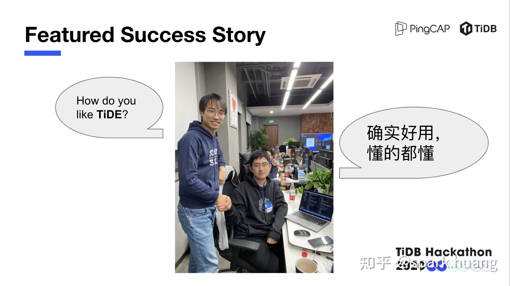
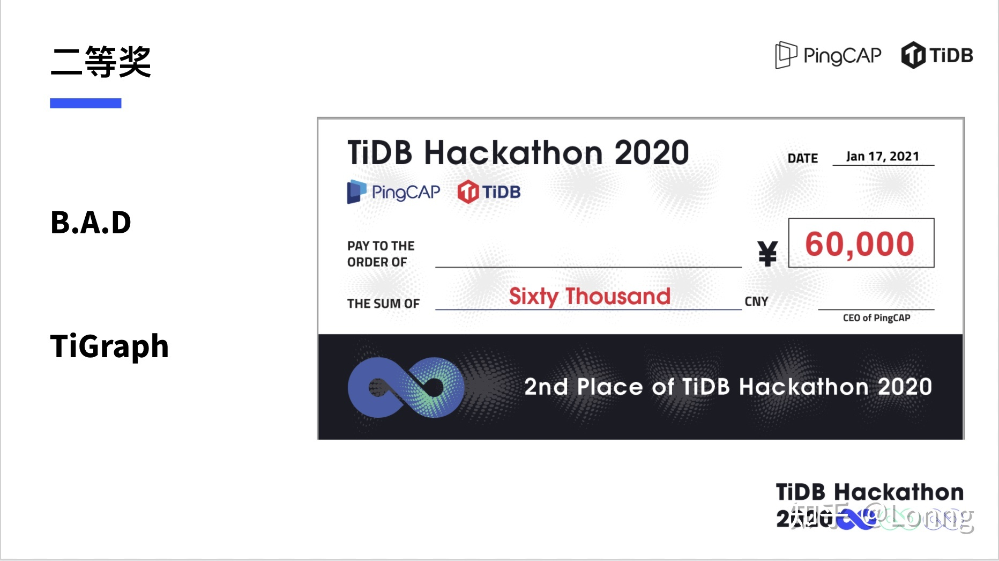
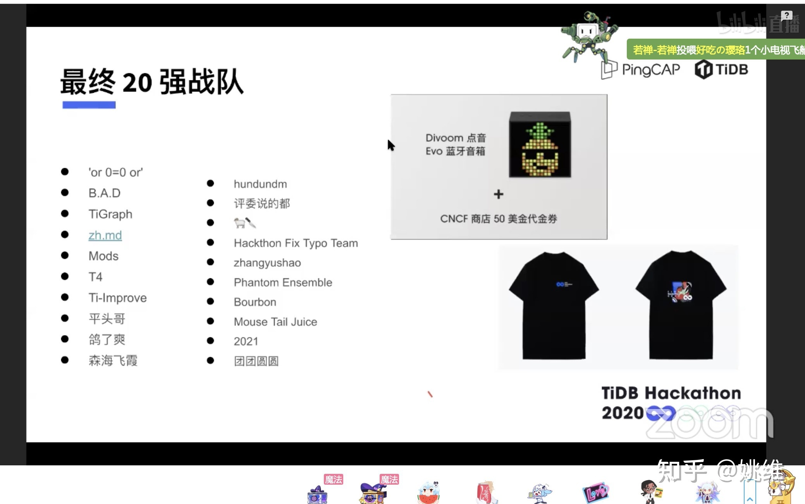
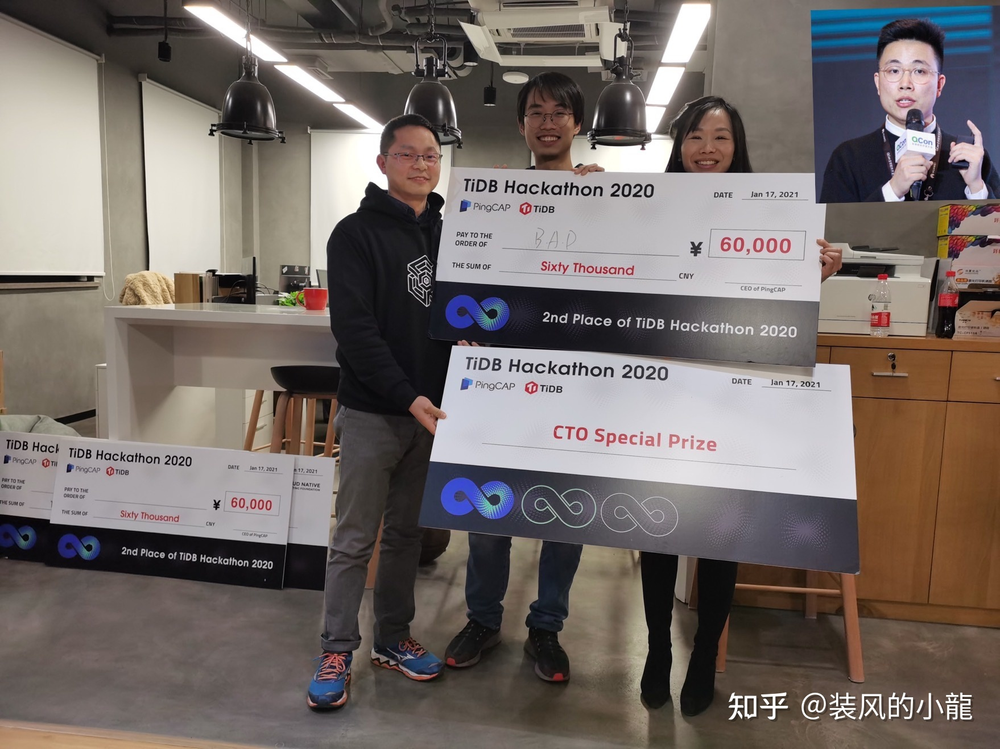
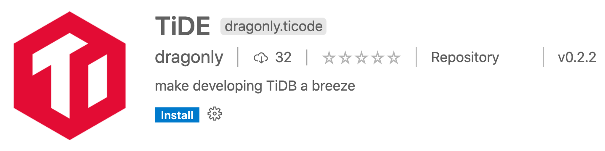

记录一下这次参加 hackathon 的经历，可以说是最开心的一次了。(有些细节记得不是那么清楚了。)

先说说背景。

话说去年也参加了贵司的 hackathon，抱上了大腿，我做了点微小的工作，后来在散伙饭上 (demo 完就撤了) 意外的得知拿了个三等奖。今年一直没想到什么好的 idea，眼看就只能当个观众了。我记得好像是大赛前一周，cto dongxu 突然在群里说他有一个特 nb 的 idea，我当时很想问一下是啥 idea，又怕太硬核了，搞不定，犹豫，一会后 cto 就说 idea 卖给小龙了。于是第二天我就顺嘴问了一下小龙，idea 是啥呀。小龙就跟我说，是这样的，cto 之前本来想给 tidb 加点功能，但是，现在 tidb 代码太复杂了，他搞了三天才把环境搭好，最后也没把代码写成。所以他想做个 vscode 插件，有点类似脚手架，当开发者想加一个功能时，比如 coprocessor，可以一键帮他把模板代码在 tidb/tikv/pd 组件中都生成了，剩下只用自己往里面填充逻辑代码就行。现在想想这个确实很 nb 呀，可以为开发者节省多少时间呀。但当时我的内心 OS，呵呵。这没啥意思呀，再说我们对三大组件也不熟，也不好做吧。

然后小龙跟我说，但是他从这个 idea 受到了启发，他发现 tidb/tikv/pd 的同学日常开发时，需要自己手动替换服务器上的二进制，手动修改组件配置，重启后再手动去捞日志看结果，很繁琐 (当然实际他们也会写各种不同的脚本来处理的，但还是要手动执行)。也不好在本地对各大组件同时进行 debug 单步调试。我们能不能用 vscode 插件把这些工作都自动化处理呢。然后他给我看了一个 k8s 的 vscode 插件，他说这个插件特别牛，不用敲一行代码就可以管理 k8s 集群，我们可以参照这个来做。

他说他已经找了杭州 office 的 k8s 专家以及 **QCON 专业讲师**阿磊同学 (后来事实证明这个选择真是太明智了)。问我要不要入伙，我表示那是当然必须加入呀。我觉得这个 idea 太好了，直击痛点，当时马上就兴奋起来，得不得奖都不重要 (现在说这话有点凡尔赛了)，这么好用的东西一定要把它给搞出来呀，造福 tidb 开发者，多有成就感呀。最关键的是，这个实现起来也不难，我以前写过 vscode 插件，还有开源代码可以参考。相比其它组的硬核技术，我们这个实现起来是 easy level，但带来的效果是却是显著的，极具冲击力，后来事实证明也是如此。你想想，你点一下鼠标，就把原来手忙脚乱，切换各种窗口，各种敲命令执行 shell 脚本，花上几分钟甚至十来分钟的活在几秒钟内干完了，你会不会受到冲击。

但是怎么跟 cto 交待呢，因为我们更换赛道了。阿磊提议我们跟 cto 开个会沟通一下，cto 说，你们这个 idea 也很好，但是，你们这个没有形成一个闭环呀，调试的前提是什么，写代码，加功能呀，如果你们能把脚手架功能加上，开发者先用脚手架一键加上功能，再进行调试，替换，整个不就形成闭环了嘛。我瞬间就体会到了什么叫产品思维。但是我们说如果加 coprocessor 这种脚手架不太好加呀，hackathon 这么短的时候怕是搞不定，cto 说那可以先用 dashboard 来试验，你不是对 dashboard 最熟嘛。想了一下，确实，dashboard 加一个新的 app 是有套路的，这个套路我熟呀。

(思考，为啥之前大家都没觉得这个地方可以改进一下呢，或许是习惯的力量太强大了吧，包括我自己在开发 dashboard 的时候也是，我一般要手动开三个 tab 来启动开发环境，经常需要手动在这些 tab 间切来切去，手动重启进程或集群。加新 app 时习惯手动 copy 一堆代码，各种替换。当最终实现的插件可以帮我在 10 秒内给 dasbhoard 加一个新的 app，自动重启各种进程时，我自己都被爽到了。)

以上是背景。之后我们 team 就确定了大致想做的东西。一个为 tidb 开发者打造的一站式 IDE，提升效率的神器。包括以下功能：

- 脚手架功能：一键给各大组件添加新功能
- 调试功能：同时调试本地或远程集群中的所有组件
- 管理远程集群功能：包括常规的启停，修改远程配置，替换二进制，查看日志，一键 SSH 等操作
- 管理本地集群功能：同上
- 管理 k8s 集群
- 拓扑管理：管理用来布署集群的 topo
- 机器管理：管理用来布署集群的机器
- Moooooore

关于项目的名字，这里也有个故事。一开始名字是小龙取的，叫 TiCode，后来 cto 说你们这个叫 tide 多好呀，我一想，这个名字妙呀，后来我们就改名叫 TiDE 了。当然，我也是后来才意识到这个和某洗护品重名了，难怪有人说我们是不是要出洗衣粉周边呢。

此时，时间已经来到了开赛周的周一。我们这个项目虽然实现上不难，但功能点较多，再加上我写代码比较慢，如果等到 hackathon 当天才动手，肯定来不及了。当下决定偷跑 (这里也要感谢项目 leader wenxuan 同学的理解)。

初步分工，小龙是队长以及 PM，也负责 k8s 一块的功能；我负责脚手架及集群管理功能；阿磊一开始比较忙，直到周五晚上才加入我们的开发，但啪的一下，很快呀，就把我们这里边最硬核的调试功能给撸出来了，简直太佩服了。

对了，小龙还把我们最难的事情干了，就是取队名，根据三个人的 github 首字母取名 B.A.D，很霸气的名字，当下就一致同意。

我一开始对脚手架功能没啥思路，再加上觉得集群管理可能是我们的工程师目前比较迫切需要的，所以决定优先实现集群管理功能。得益于贵司已经有一个非常强大的管理集群的命令行工具 tiup (在这里要 big thanks to tiup team 的同学)，这部分工作实现起来很轻松。(真的，我之前都没有意识到原来 tiup 这么强大。)

到了周五，集群管理这一块的功能开发得差不多了，然后尝试给了几个同事 demo 一下，结果一下子就把他们震惊住了，直呼卧槽，这也太爽了吧。看来这确实是有价值的，得到了大家的认可，我们非常开心。随即同事们就开始提需求了，诶，这个重启能不能支持一下只重启单个实例或单个组件呀，替换后我不想让监控组件也重启呀。这很合理，必须满足，马上安排上；诶，bench 功能能不能支持一下呢。嗯，这个也可以有，加到 todo 哈。

demo 还吸引来了贵司销售 s 的加盟，她说她坚定地看好我们 team，要为我们摇旗呐喊，为我们拉票。她在各大群里发红包，最后让我们在人气榜也挺进了前四 (嗯，前四就是第四)。

想到还有这么多 todo 可以做，兴奋得已经不想回家了。当晚在公司肝到两点多钟，把同事们提的重要需求给补上，录了两个使用视频发布到了 youtube 上准备明天拉拉票用。早上 6 点多突然想到自己有 b 站账号呀，干嘛不上传到 b 站呀。于是一骨碌爬起来重新把视频上传到 b 站 (...居然要审核，不过也是意料之中)，准备了一些文案，准备等同事们都醒了在大群里拉一波票。

然后对脚手架也有了思路，就用简单粗暴的插桩大法就行了 (不知道有没有更优雅的方法)，就是在 tidb dashboard 需要修改的地方插入以注释形式存在的 placeholder，后面一键替换掉；需要新加的文件放到模板里，里面也插桩，之后拷贝到 dashboard 的目标目录中再把 placeholder 替换掉。如此操作之后，就可以 10 秒钟给 dashboard 添加一个新的独立功能页面了 (包括前后端功能)。展示效果极好，在 demo 环节还是果然前端有优势啊。

说到这个功能，稍微有点遗憾的就是，要是早一天开发出来，就能给友 team hundunDM 组 (获奖队伍之一）用上，节省他们的时间了。他们在 dashboard 中新增了一个 app 用来可视化集群的 region 分布等信息，很酷炫。hundunDM 他们对 dashboard 前端代码不怎么熟悉，所以就问我应该在哪加，要修改哪些文件。因为要加的文件有点多，我只好找了个之前的一个 PR 给他们看，然后告诉他们应该怎么怎么加。

另外还有一个花絮。在 hackathon 现场，有一位友 team 的开发者遇到了 tiup 的使用困难，在小龙的热心帮助下解决了。他非常感激，并想试用一下我们的产品。小龙说项目才 0.1.0，这好吗？他说能提升我的开发效率，解放我的思路，确实好用，懂的都懂。

到此，我们项目的功能就能形成闭环了。用户用脚手架功能一键添加新功能，然后一键布署本地集群，一键调试各大组件，一键修改配置，一键查看日志 ... awesome!

剩下就是准备第一轮的闪电答辨和第二轮的 demo 环节了，这时候就突显出我们组拥有 QCON 专业讲师 (阿磊) 和抖梗大师 (小龙) 的优势了。看了阿磊和小龙准备的 PPT，我直呼优秀！第一轮的闪电答辨，阿磊都讲 high 了，我感觉就像是在听相声一样！

虽然收获了很多认可，但看到其它 team 的项目都那么硬核，我们的心理预期是收获一个 cto 特别奖就行了。但当最后结果出来时，还是很出乎我们意料，我们居然同时收获了 cto 特别奖和二等奖，最后排名仅次于 wenxuan 组的 UDF。非常开心，这真是一次愉快的 hackathon 之旅。

最后，放一下我们项目的链接：https://github.com/dragonly/ticode 截止发表这篇文章时，目前已经 37 star 了，vscode 应用商店也有高达 32 的下载量了。

相关链接：

- [参加 TiDB Hackathon 是什么体验？](https://www.zhihu.com/question/439654278)
