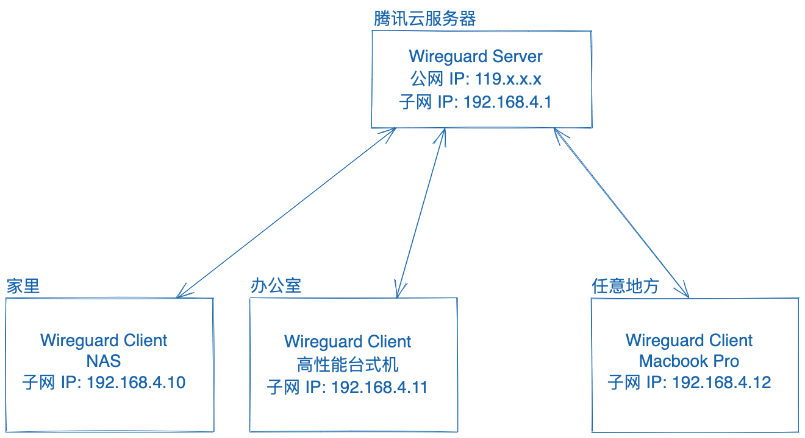
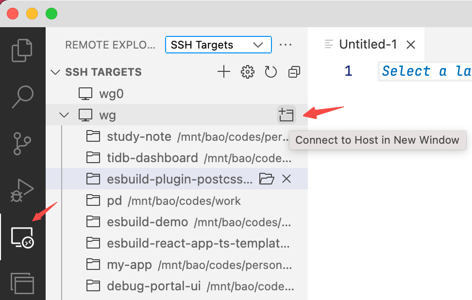
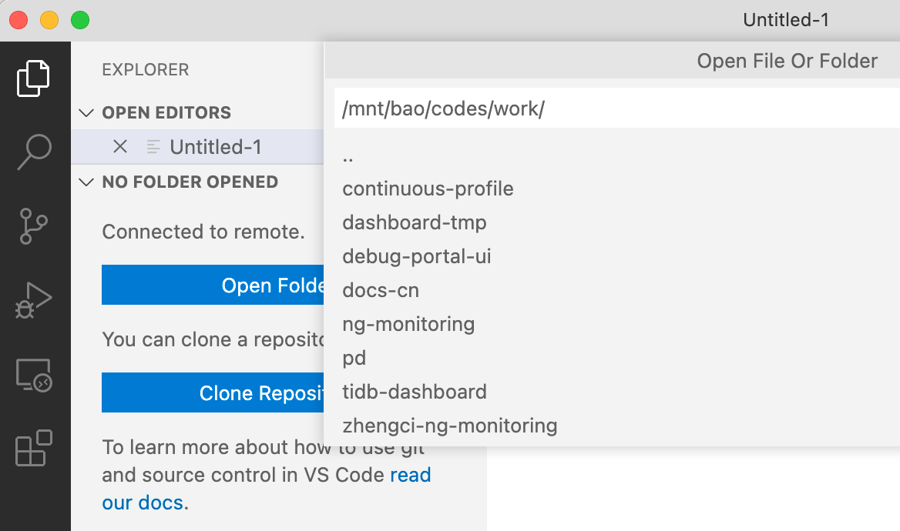

## 起因

目前工作用的电脑是一台 2019 年 Macbook Pro，i5 CPU，16GB 内存，256GB 的 SSD。电脑上主要是开发相关的项目和文件，但不知道为什么磁盘空间一直在不停的减少，我甚至还买了一个外置的 samsung 512GB 高速 SSD 硬盘，把占空间较大的虚拟机，tiup 镜像库，TiDB/TiKV/PD 这些项目都移到了外置硬盘上。docker images 没法迁移，但把不用的镜像都删掉了。


神奇的是，即使清理出这么多空间，电脑内置的空间还是在不停地减少，用 ncdu 命令也分析不出体积特别大的文件和目录了。

现在我的日常剩余空间，重启后能有 10GB 左右，运行一段时间后，降低到 2~3GB，极端的时候仅剩余数百 MB。一段时间就要重启一次。


除了捉襟见肘的磁盘空间，续航也是一个大问题，在本机开发 TiDB Dashboard 时，一般要用 tiup 起一个 TiDB 集群，起一个 TiDB Dashboard 的 web 后端，再起一个 TiDB Dashboard 的前端，虽然它们可能不是耗电大户，但只要我不插电去开个会，可能一个小时就可以从满电降电 10% 以内。

看到有同事用 wireguard + vscode remote 的方式进行开发，于是也想尝试一下，本文记录配置过程。

(其实一开始是想直接找一台性能好的，硬盘容量大一些的云服务器，但是看了一下，目前的云服务器一盘硬盘空间都不大，而且也不便宜，所以放弃。)

## Wireguard 介绍

一种现代 VPN 技术，相比其它，它更快，更容易配置，性能更好。适合服务器之间互联 (不适合当梯子)。

## 最终实现拓扑



(高性能大容量的台式机是蹭了同事的机器，放置于办公室中。)

## Wireguard 服务端的配置

首先我们需要一台具有公网 IP 的 VPS 作为 wireguard 的服务端作为数据转发中心。这个 VPS 不需要太高性能，一般配置就行，但带宽最好高一些，比如 8M，10M 这样，而且最好选择离你比较近的 region，我一开始不小心选了一台香港区的腾讯云服务器，导致延时比较高，效果不好，后面只好蹭了同事的一台本地的服务器。

这里只记录在 ubuntu 发行版上的配置过程。

主要参考来源：[搭建 WireGuard](http://philip.wang/2020/04/16/SetupWireGuard.html)

### 安装

```bash
$ sudo add-apt-repository ppa:wireguard/wireguard
$ sudo apt-get update
$ sudo apt-get install wireguard
```

### 生成密钥对

生成一对公钥和私钥用于数据传输加密，公钥给所有客户端 (即 peer) 使用。

```bash
$ cd /etc/wireguard
$ umask 077
$ wg genkey | tee privatekey | wg pubkey > publickey
```

如果遇到 /etc/wireguard 目录无法访问等权限问题，使用 sudo chmod 命令修改其权限。

上述命令在 /etc/wireguard 目录下生成了 privatekey 和 publickey 两个文件，内容都是一串字符串。

### 配置服务端

在 /et/wireguard 目录下创建 wg0.conf 配置文件，内容如下：

```conf
[Interface]
PrivateKey = <server private key>
Address = 192.168.4.1/24
ListenPort = 51820
# 在虚拟网卡启动后的动作。这里将接受所有的客户端共享服务端的 IP 地址，并写入路由表中
PostUp = iptables -A FORWARD -i wg0 -j ACCEPT; iptables -t nat -A POSTROUTING -o eth0 -j MASQUERADE; ip6tables -A FORWARD -i wg0 -j ACCEPT; ip6tables -t nat -A POSTROUTING -o eth0 -j MASQUERADE
# 在虚拟网卡断开后的动作。这里将客户端共享服务端 IP 地址的规则从路由表中删除
PostDown = iptables -D FORWARD -i wg0 -j ACCEPT; iptables -t nat -D POSTROUTING -o eth0 -j MASQUERADE; ip6tables -D FORWARD -i wg0 -j ACCEPT; ip6tables -t nat -D POSTROUTING -o eth0 -j MASQUERADE
```

### 配置防火墙

上面的配置中我们使用了 51820 作为监听端口，而且是 udp 端口，因为 wireguard 使用的是 udp 协议。所以要在防火墙中把此端口开放。

作为 ssh 登录的 22 tcp 也一并开放。

```bash
$ sudo ufw allow 51820/udp
$ sudo ufw allow 22/tcp
$ sudo ufw enable
$ sudo ufw status verbose
```

另外，如果使用了云厂商的云服务器，还需要在云厂商的管控页面中再设置一下防火墙，比如：


### 设置转发

我们需要客户端之间可以通信，它们通过服务器进行中转，因此需要服务器允许转发。

```bash
$ vi /etc/sysctl.conf

# 找到下面这一行，去掉注释来允许 IP 转发
net.ipv4.conf.default.rp_filter=1

# 退出编辑后，通过下面命令使其生效
$ sysctl -p
$ echo 1 > /proc/sys/net/ipv4/ip_forward
```

我在执行 `echo 1> xxx` 的时候遇到了权限的问题，后来使用下面的语句成功。

```bash
$ sysctl -w net.ipv4.ip_forward=1
```

### 启动服务端

```
$ sudo wg-quick up wg0
```

重启用 `sudo wg-quick down wg0 && sudo wg-quick up wg0`，最好不要单独执行 `sudo wg-quick down wg0`，如果在一台远程客户机上执行此命令，这台机器就断开连接了。

查看状态：`sudo wg [show]`

### 设置开机启动

```
$ systemctl enable wg-quick@wg0
```

## 客户端配置

这里只记录 mac 上客户端的配置，其它操作系统应该大同小异。

### 安装客户端

```
$ sudo brew install wireguard-tools
```

### 生成密钥对

在 /usr/local/etc 目录下创建 wireguard 目录。

```
$ cd /usr/local/etc/
$ umask 077
$ mkdir wireguard
$ cd wireguard
$ wg genkey | tee privatekey | wg pubkey > publickey
```

公钥将用于服务端配置。

### 配置客户端

在 /usr/local/etc/wireguard 目录下创建 wg0.conf 配置文件。

```
[Interface]
PrivateKey = <client private key>
Address = 192.168.4.12/24

[Peer]
PublicKey = <server public key>
Endpoint = <server public IP>:51820 # 服务端公网 IP:PORT
AllowedIPs = 192.168.4.1/24
PersistentKeepalive = 15
```

Peer 是服务端。

几个注意点：

1. 客户端不需要指定 ListenPort，会自动选择一个可用的端口号
1. PersistenKeepalive 用来使客户端和服务端保持心跳，单位是秒，在被连接的客户端一定要配置上，比如上面拓扑中的 nas 和台式机，不然一段时间后它们和服务器之间就断开连接了；主动发起连接的客户端可以不需要配置。

### 启动客户端

```
$ sudo wg-quick up wg0
```

### 配置其它客户端

按照上面的步骤配置好台式机上的 wireguard 客户端，台式机也是 ubuntu 系统，wireguard 配置放置于 /etc/wireguard/wg0.conf，其配置内容如下所示：

```
[Interface]
PrivateKey = <client private key>
Address = 192.168.4.11/24

[Peer]
PublicKey = <server public key>
Endpoint = <server public IP>:51820 # 服务端公网 IP:PORT
AllowedIPs = 192.168.4.1/24
PersistentKeepalive = 15
```

NAS 上 wireguard 的配置有点特殊，后面再补上。

## 更新服务端配置

将所有客户端加到服务端的配置的 Peer 字段中。修改服务端的 /etc/wireguard/wg0.conf，添加 Peer 字段，一个 Peer 表示一个客户端。

```
[Peer]
PublicKey = <desktop machine client public key>
AllowedIPs = 192.168.4.11/24

[Peer]
PublicKey = <macbook pro client public key>
AllowedIPs = 192.168.4.12/24
```

并重启服务端的 wireguard: `sudo wg-quick down wg0 && sudo wg-quick up wg0`。

## 测试连接

从 macbook pro 上 ping 台式机的 IP:

```
$ ping 192.168.4.11
PING 192.168.4.11 (192.168.4.11): 56 data bytes
64 bytes from 192.168.4.11: icmp_seq=0 ttl=63 time=18.996 ms
64 bytes from 192.168.4.11: icmp_seq=1 ttl=63 time=19.324 ms
```

能 ping 通则说明连通了。

## 配置 ssh 免密登录

配置好 wireguard 后，macbook pro 现在可以在任意地方通过 `ssh <user_name>@192.168.4.11` 登录到台式机进行工作了。

配置一下免密登录 (略，后面补)，在 ~/.ssh/config 中添加以下内容：

```
Host wg
  HostName 192.168.4.11
  User bao
  IdentityFile ~/.ssh/id_rsa
```

这样就可以用 `ssh wg` 一条命令登录到台式机上了。

这也是为后面 VSCode Remote 的做的准备工作。

## VSCode Remote

如果没有 VSCode Remote，即使配置好了 wireguard，我们的开发体验和本地开发差远了，我们只能 ssh 到台式机上，用无 UI 的 vim 来编辑代码。

而有了 VSCode Remote 后，我们的开发体验和本地几乎没有区别，我觉得可以用伟大来形容它。(不知道以前有没有过类似产品呢?)

而它的使用也非常简单，只需要安装一个插件 - "Remote Development" 就行。

在插件商店搜索 "Remote Development"，它其实是一个插件套件，里面包括了 Remote-SSH，Remote-Container，Remote-WSL 三个插件，虽然目前我们只需要 Remote-SSH，但全装上也无妨。

装上这个插件后，左侧栏就会出现一个 "Remote Explorer" 的图标，点击，显示前面在 `~/.ssh/config` 中配置好的 ssh 目标机器。



点击 ssh target 右边的 "Connect to Host in New Window"，将会打开一个新的窗口，在这个窗口里，相当于此时环境已经是在 ssh 目标机器上了，选择目标主机里的某个项目打开即可。



然后接下来就像是在本地开发一样。

### 端口转发

我们在 vscode remote 环境中启动了一个前端项目，它使用端口 3000，这个服务是在远程主机上启动的，而不是本地，那我们在本地浏览器还能像以前一样用 localhost:3000 或 127.0.0.1:3000 来访问吗？答案是可以的。

如果我们是在 vscode 自带的 terminal 中启动项目，且此项目监听某个端口，vscode remote 会自动帮我们做端口转发，将本地的相同端口号转发到远程主机上，比如上例中，vscode remote 就会自动将本地的 3000 端口转发到远程主机的 3000 端口上，假如远程主机 IP 是 192.168.4.11，则访问 localhost:3000 就相当于访问了 192.168.4.11:3000。

如果直接 ssh 到的远程主机上启动了一些 web 服务，则可以在 vscode 的 PORTS tab 中手动添加需要做端口转发的端口。

如下图所示：


## 总结

需要最初的起因是磁盘空间和续航，实际最后问题也仅仅是得到了缓解，磁盘空间还是在神秘的减少，但好像减少得更慢了，续航的效果稍明显一些，毕竟我在本机几乎不再创建任何新项目，也不再起一些服务。

但我着实感受到了这种开发模式的方便，我现在拿一台 n 年前的 windows 笔记本，也能马上上手开发，只要配置好 wireguard，安装好 vscode 就 ok 了，不用强劲性能，不用配置开发环境，不用 clone 代码，也不用担心电脑休眠导致后台任务中断。
