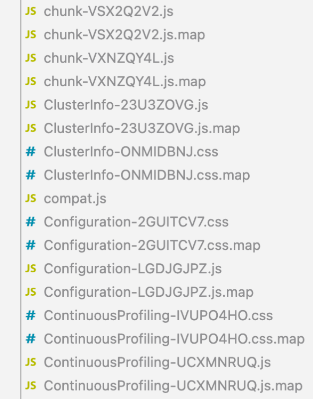

## 背景

最近，我们对 [TiDB Dashboard 项目](https://github.com/pingcap/tidb-dashboard)做了一个试验，将打包工具由 webpack 替换成 esbuild。原因不用多说，webpack 的打包速度太慢了，开发模式，每次执行 `yarn start` 后需要 30~40s 才能看到结果；生产模式，一次 build 需要 70~80s；Github Actions 上一次 build 则需要 2min 左右。

试验效果显著，在台式机 (CPU: Intel Core i5-9400F @ 6x 4.1GHz, Memory: 64GB) 上的对比结果如下所示：

| --              | webpack     | esbuild |
| --------------- | ----------- | ------- |
| dev             | 31s         | 7.7s    |
| dev incremental | fast by hrm | 600ms   |
| production      | 70.7s       | 7.7s    |

一次完整 build 中，还包括了生成 swager api 等其它工作，这些工作大约耗时 2~3s，除去这些工作后，真正的打包时间从 **67.8s** 降低至 **5.3s**。

在 Github Actions 上的对比结果：

| --             | webpack | esbuild |
| -------------- | ------- | ------- |
| Github Actions | 128s    | 19s     |

[完整 PR 链接](https://github.com/pingcap/tidb-dashboard/pull/1063) (目前还在 Code Review 中)

### 为什么不用 Vite

不用 Vite 有以下几个考量：

1. 我们想同时降低开发模式和生产模式的打包时间，而 Vite 生产模式仍然使用 Rollup，并不能显著降低生产模式的打包时间
1. Vite 在开发和生产模式下采用不同的打包方式，因此并不能保证开发模式和生产模式得到一致的结果

## 迁移过程

### 生产模式

直接调用 esbuild 的 build(options) 方法即可，build 之后，还需手动处理 assets。

```js
// builder.js
const fs = require('fs-extra')
const { build } = require('esbuild')

const esbuildParams = {...}

async function main() {
  fs.removeSync('./build')

  const builder = await build(esbuildParams)
  handleAssets()

  process.exit(0)
}

main()
```

#### 处理 assets

handleAssets() 方法中做的工作，包括将 public 目录中的 assets 拷贝到 build 目录中，将 html 中的变量 (比如 `%PUBLIC_URL%`) 替换成真实的值。

```js
// 复制 public 中的静态文件到 build 目录中
function handleAssets() {
  fs.copySync('./public', './build')
  buildHtml('./public/index.html', './build/index.html')
}

// 修改 html 文件，替换变量
function buildHtml(inputFilename, outputFilename) {
  let result = fs.readFileSync(inputFilename).toString()

  const placeholders = ['PUBLIC_URL']
  placeholders.forEach((key) => {
    result = result.replace(new RegExp(`%${key}%`, 'g'), process.env[key])
  })

  fs.writeFileSync(outputFilename, result)
}
```

相比 webpack，esbuild 的编译脚本需要自己手动操作更多事情，但我个人更喜欢这种方式，可以掌控更多细节。

上面修改 html 文件时用到了 `process.env`，webpack 会帮我们自动加载 .env/.env.development/.env.production 这些文件中的变量到 `process.env` 并注入到前端项目的运行时中，但 esbuild 并不会做这些工作，尤其是注入到运行时中，这个后面会讲到。

先来看一下如何将 .env.development/.env.production 中的变量加载到编译脚本的 process.env 变量中。

#### 加载 .env

```js
const isDev = process.env.NODE_ENV !== 'production'

// handle .env
if (isDev) {
  fs.copyFileSync('./.env.development', './.env')
} else {
  fs.copyFileSync('./.env.production', './.env')
}
// load .env file
require('dotenv').config()
```

很简单，当发现是开发环境时，将 .env.development 文件复制到 .env 文件，如果是生产环境，就把 .env.production 文件复制到 .env 文件，然后调用 dotenv 库的 config() 方法加载 .env 文件。dotenv 只负责加载 .env 文件。

接下来看看核心的 esbuildParams 的值。

#### esbuild options

```js
const esbuildParams = {
  color: true,
  entryPoints: {
    dashboardApp: 'src/index.ts',
    diagnoseReport: 'diagnoseReportApp/index.tsx',
  },
  loader: { '.ts': 'tsx', '.svgd': 'dataurl' },
  outdir: 'build',
  minify: !isDev,
  format: 'esm',
  bundle: true,
  sourcemap: true,
  logLevel: 'error',
  incremental: true,
  splitting: true,
  platform: 'browser',
  plugins: [
    postCssPlugin.default({
      lessOptions: {
        modifyVars: lessModifyVars,
        globalVars: lessGlobalVars,
        javascriptEnabled: true,
      },
      enableCache: true,
    }),
    yamlPlugin(),
    svgrPlugin(),
  ],
  define: genDefine(),
  inject: ['./process-shim.js'], // fix runtime crash
}
```

我们捡重要的项来说明。

#### entryPoints

```js
entryPoints: {
  dashboardApp: 'src/index.ts',
  diagnoseReport: 'diagnoseReportApp/index.tsx',
}
```

和 webpack 的 entry 一样，用来声明入口文件。因为这个项目中有两个独立的 app ，所以定义了两个 entry point，并命名为 dashboardApp 及 diagnoseReport。

如果不为 entry point 命名，则生成的文件会输出到 `./build/src/index.js|css`，`./build/diagnoseReportApp/index.js|css`。命名后则输出到 `./build/dashboardApp.js|css`，`./build/diagnoseReport.js|css`。

为何第一个 entry point 不命名为 dashboard 呢，这里遇到了个坑，在开发模式下，用代理的方法实现了设置 base url 为 `/dashboard`，所有到 `http://127.0.0.1/dashboard` 的请求都会转发到 `http://127.0.0.1/`，因此 `http://127.0.0.1/dashboard/dashboard.css` 的请求会先变成 `http://127.0.0.1/dashboard.css`，再变成 `http://127.0.0.1/.css` (有点离谱)。所以把它改名为 dashboardApp 以避开这个坑。

#### spilitting & format

```js
splitting: true,
format: 'esm',
```

当设置 splitting 为 true 后，使用动态 import 导入的代码将会单独打包，生成独立的 js 文件，运行时再进行加载。



当开启 splitting 后，esbuild 输出的 js 格式只支持 esm。

当输出格式为 esm 时，需要在 html 中使用 `type="module"` 来声明加载 esm 模块。

```html
<script type="module" src="%PUBLIC_URL%/dashboardApp.js"></script>
```

#### define

```js
const esbuildParams = {
  ...
  define: genDefine()
  ...
}

function genDefine() {
  const define = {}
  for (const k in process.env) {
    if (k.startsWith('REACT_APP_')) {
      let envVal = process.env[k]
      // Example: REACT_APP_VERSION=$npm_package_version
      // Expect output: REACT_APP_VERSION=0.1.0
      if (envVal.startsWith('$')) {
        envVal = process.env[envVal.substring(1)]
      }
      define[`process.env.${k}`] = JSON.stringify(envVal)
    }
  }
  return define
}
```

前面说到，esbuild 不会把 .env 里的变量注入到前端运行时中，因此如果我们代码里如果用到了 `process.env.REACT_APP_xxx` 这样的变量，如果不做任何处理，则会报运行时崩溃，procees.env 为 undefined。

esbuild 的处理办法是，把所有这类的变量提前声明到 define 选项中，然后在编译期进行整体替换。

比如下面的代码：

```js
const version = process.env.REACT_APP_VERSION
```

假如我们声明 `define['process.env.REACT_APP_VERSION'] = '0.1.0'`，那上述代码编译后变成：

```js
const version = '0.1.0'
```

那如果我的代码里大量用到了 process.env.XXX，而我不想一个一个都声明到 define 中 (也即定义到 .env 文件中)，就想实现如果没有在 define 中声明，则值为 undefined 的效果呢。

可以用 inject。

#### inject

```js
// builder.js
const esbuildParams = {
  ...
  inject: ['./process-slim.js']
  ...
}
```

```js
// process-shim.js
export let process = {
  cwd: () => '',
  env: {},
}
```

前面 define 是用来在编译期替换变量，inject 则是用来注入运行时的方法或变量。

因为有依赖库会在运行时执行 `process.cwd()` 方法，而浏览器中并没有此方法，因此我们使用 inject 注入一个空的 `process.cwd()` 方法来避免运行时崩溃。

上面说到，默认 esbuild 不会往前端运行时注入 process.env 变量，因此我们可以通过 inject 手动注入一个空的 `process.env` 对象。

#### platform

```js
const esbuildParams = {
  ...
  platform: 'browser',
  ...
}
```

```json
// package.json
{
  ...
  "browser": {
    "path": "path-browserify"
  }
  ...
}
```

有第三库会 require path 这个 node 包，但浏览器中没有这个包，通过声明 `platform: 'browser'`，并在 package.json 的 browser 字段声明将 node 包替换成兼容浏览器的包。(这个工作在 webpack 中是 webpack 帮我们做的)

#### Plugins

```js
const postCssPlugin = require('@baurine/esbuild-plugin-postcss3')
const { yamlPlugin } = require('esbuild-plugin-yaml')
const svgrPlugin = require('esbuild-plugin-svgr')

const esbuildParams  = {
  ...
  plugins: [
      postCssPlugin.default({
        lessOptions: {
          modifyVars: lessModifyVars,
          globalVars: lessGlobalVars,
          javascriptEnabled: true,
        },
      }),
      yamlPlugin(),
      svgrPlugin(),
    ],
  ...
}
```

esbuild 本身只能处理 js, css 等文件。我们项目中用到了 less, yaml, svg，因此需要额外的插件。

使用 esbuild-plugin-yaml 来处理 yaml 文件，将 yaml 转换成 js object。

使用 esbuild-plugin-svgr 处理 svg，将 svg 转换成 React Component。

使用 esbuild-plugin-postcss3 (fork 自 esbuild-plugin-postcss2) 来处理 css|less|scss|css-module。它内部根据文件后缀调用相应的编译器，比如 less, node-sass 来编译相应的文件。

##### esbuild-plugin-postcss2

在使用 esbuild-plugin-postcss2 编译 less 等 css 样式文件时，遇到了以下几个问题：

1. 无法编译 @fluentui/react 库的代码，这个库中的 .js 文件在加载样式时会 `import "../xxx.scss"` 文件，但实际 xxx.scss 不存在，而存在的是 xxx.scss.js 文件 (骚操作...)，esbuild 直接把这个 xxx.scss 交给 esbuild-plugin-postcss2 插件处理，显然将处理失败
1. `import 'bulma/css/bulma.css'` 编译失败，提示找不到 bulma/css/bulma.css 这个文件，实际它好好地在那呢。

后来经过阅读插件源码及调试，发现是插件内部 resolve imported file 的路径的逻辑有问题，已经反馈给上游并提交 [PR](https://github.com/martonlederer/esbuild-plugin-postcss2/pull/32)，但上游没有响应，所以我只好自己 fork，自行修复并 publish。

#### loader

```js
const esbuildParams = {
  ...
  loader: { '.ts': 'tsx', '.svgd': 'dataurl' },
  ...
}
```

loader 和 webpack 中的 loader 概念差不多。但 esbuild 中的 loader 都是内置的，没有第三方 loader。

前面我们使用 esbuild-plugin-svgr 插件处理 .svg 文件，但它只能将 svg 返回为 ReactComponent。

我们的项目中还有将 svg 作为背景使用的用法，这种用法 esbuild-plugin-svgr 无法处理。

但由于一旦用了 esbuild-plugin-svgr 后，它就接管了所有 .svg 的处理。

因此，我们将作为背景使用的 .svg 图片重命名为 .svgd 后缀，以绕过 esbuild-plugin-svgr 插件。

并使用 esbuild 内置的 dataurl loader 将 .svgd 返回为 baes64 编码的 data string。

但由于 .svgd 是一种未知的后缀，dataurl 将其识别为 text/plain 格式，而不是我们需要的 image/svg+xml，因此我们在代码里手动替换一下。

```tsx
// signin/index.tsx
import landing from './landing.svgd'
const landingSVG = landing.replace('data:text/plain', 'data:image/svg+xml')

          <div
            style={{ backgroundImage: `url(${landingSVG})` }}
            className={styles.landing}
          />
```

同时在 .d.ts 中声明 .svgd 类型：

```ts
// src/react-app-env.d.ts
declare module '*.svgd' {
  const src: string
  export default src
}
```

另外，还有一种解法是，将所有 svg 的用法统一成使用 `url(path)`，然后将 svg 挪到 public 目录中作为静态资源，而不是直接编译进项目代码里，这样连 esbuild-plguin-svgr 插件都不需要使用了。

### 开发模式

相比生产模式，开发模式还需要：

- 启动一个 dev server 来实现查看编译结果
- 监控文件变动，有变动则重新编译

我们使用 live-server 来启动 dev server，使用 chokidar 来监控文件变化。(live-server 内部也是用 chokidar 来监控文件变化的)

整个流程：

1. 初次完整编译
1. 用 live-server 启动 dev server，它会监控 build 目录中的文件变化，如果有变化，则通知浏览器 reload
1. 使用 chokidar 监控源码的变动，有变动则重新编译，触发 build 目录文件变化，进而触发 live-server 通知浏览器刷新

```js
const { start } = require('live-server')
const { watch } = require('chokidar')

async function main() {
  fs.removeSync('./build')

  const builder = await build(esbuildParams)
  handleAssets()

  if (isDev) {
    start(devServerParams)

    const tsConfig = require('./tsconfig.json')
    tsConfig.include.forEach((folder) => {
      watch(`${folder}/**/*`, { ignoreInitial: true }).on('all', () => {
        builder.rebuild()
      })
    })
    watch('public/**/*', { ignoreInitial: true }).on('all', () => {
      handleAssets()
    })
  }
  ...
}
```

在 watch() 时加上 `{ ignoreInitial: true }` 来避免将这些文件添加进 watch list 时就进行重新编译。

看一下 devServerParams 的设置：

```js
const dashboardApiPrefix =
  process.env.REACT_APP_DASHBOARD_API_URL || 'http://127.0.0.1:12333'

const devServerPort = process.env.PORT

const devServerParams = {
  port: devServerPort,
  root: 'build',
  open: '/dashboard',
  // Set base URL
  // https://github.com/tapio/live-server/issues/287 - How can I serve from a base URL?
  proxy: [['/dashboard', `http://127.0.0.1:${devServerPort}`]],
  middleware: isDev && [
    function (req, _res, next) {
      if (/\/dashboard\/api\/diagnose\/reports\/\S+\/detail/.test(req.url)) {
        req.url = '/diagnoseReport.html'
      }
      next()
    },
    createProxyMiddleware('/dashboard/api/diagnose/reports/*/data.js', {
      target: dashboardApiPrefix,
      changeOrigin: true,
    }),
  ],
}
```

#### middleware

live-server 支持设置自定义的 middleware，我们可以在这里进行各种拦截，修改请求，修改响应等操作。

我们在这里设置了两个 middleware，是为了支持在开发模式下访问 diagnoseReportApp 页面。

#### proxy

在 webpack 中可以很方便地设置 base url，只需要 package.json 中指定 homepage 就行。但在 live-server 中没有直接指定 base url 的地方。可以通过 proxy 属性来曲线实现。

```js
proxy: [['/dashboard', `http://127.0.0.1:${devServerPort}`]]
```

这个配置会把所有 `http://127.0.0.1:3001/dashboard/xxx` 的请求指向 `http://127.0.0.1:3001/xxx`

前面提到过这里有个坑，`http://127.0.0.1:3001/dashboard/dashboard.css` 会先变成 `http://127.0.0.1:3001/dashboard.css` ，然后再变成 `http://127.0.0.1:3001/.css` ，最终结果是 404。

#### plugin cache

在 dev 模式下，修改一行 js 或 css 代码后，增量编译时间达到了 4s 多，不能令人接受。通过测试发现，纯 js 的增量编译时间只需要 500ms 左右，其余主要是 css 的编译时间。

根据[官网上的建议](https://esbuild.github.io/plugins/#caching-your-plugin)，我们可以对插件处理结果进行缓存。

于是修改 esbuild-plugin-postcss2 代码，加上缓存机制，对没有修改的 css 文件不再重新编译，直接复用之前的编译结果。

大致逻辑如下所示：

```js
let cache = new Map()
// cache = {
//   'srcPath': {
//     lastMtimeMs: 1634030364414,
//     output: ''
//   }
// }

...

// query cache
let cacheVal = cache.get(sourceFullPath)
if (cacheVal && cacheVal.lastMtimeMs === stat.mtimeMs) {
  tmpFilePath = cacheVal.output
}

...

// update cache
cache.set(sourceFullPath, {
  lastMtimeMs: stat.mtimeMs,
  output: tmpFilePath,
})
```

加上缓存后，效果非常明显，增量编译时间从 4s 多降低到 600~700ms。

相关 [PR](https://github.com/martonlederer/esbuild-plugin-postcss2/pull/29) 也反馈给上游了，但上游没有响应，所以用了自己 fork 的插件版本。
