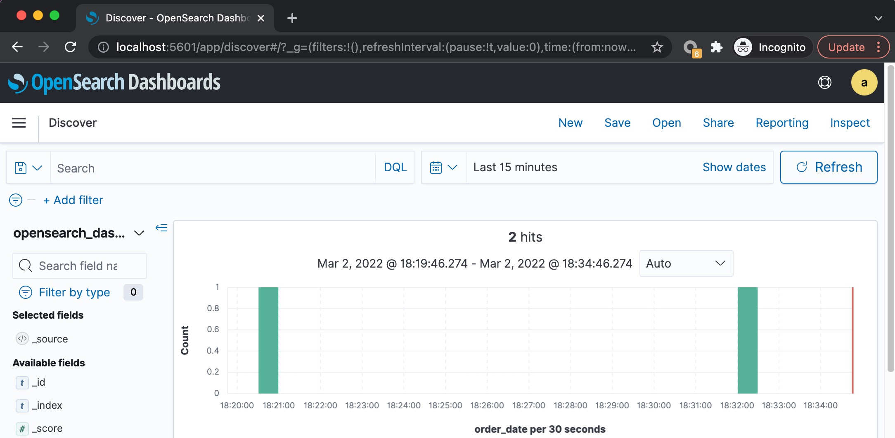
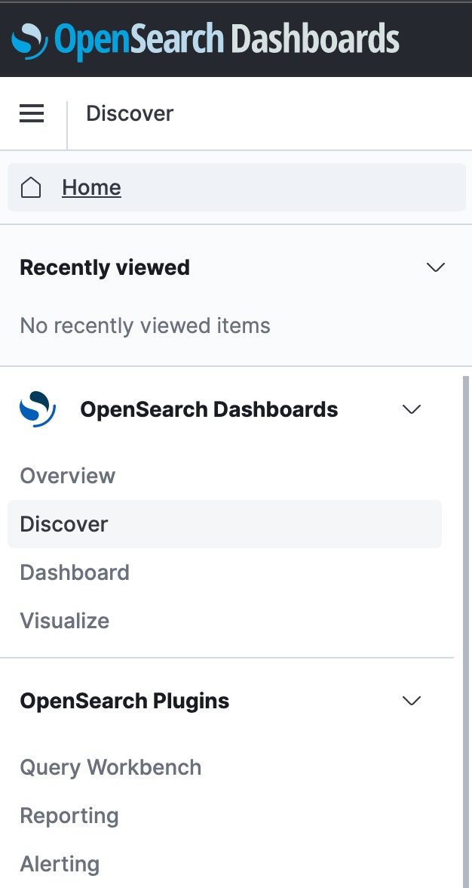
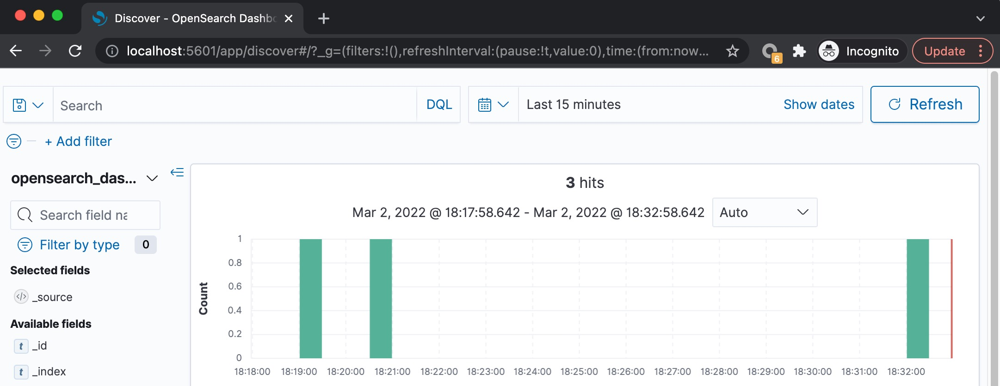
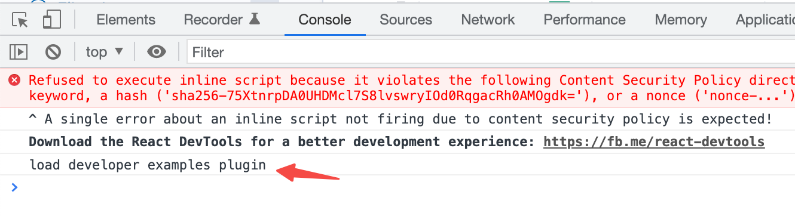
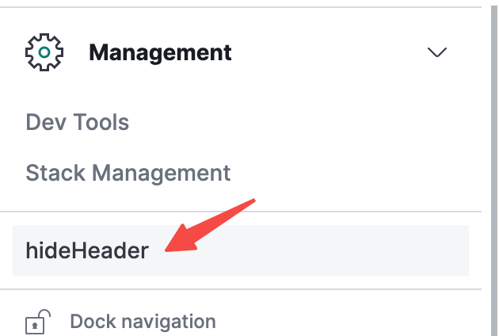

最近接到一个有意思的需求，简单记录一下解决过程。

## 背景

需求是这样的，我们使用 AWS 的 OpenSearch (即 Elastic 的 Fork 版本) 部署了一套日志服务，用户使用 OpenSearch Dashboards (也即 Kibana 的 Fork 版本) 查看。但我们只想让用户查看日志 (即 Discover 功能)，不想让他们使用 Dashboard / Visualize 等其它功能，界面上需要隐藏这些功能的入口。

原始界面：





预期效果 (也是最终的实现效果)：



## 调研

简单调研了一下，发现 Kibana 官方提供了关闭相应功能入口的功能 - [链接](https://www.elastic.co/guide/en/kibana/current/kibana-privileges.html#_assigning_feature_privileges)，但是很不幸，OpenSearch Dashboard (后面简称 OSD) 还没有加入此功能。

首先尝试通过 OSD 的 role 进行权限控制，实话说，这玩意太复杂，整不明白，而且即使加上了一些 read only 权限的 role，导航 menu 还会在界面上显示，用户可以进入这些页面，只不过执行一些操作时会提示错误。

当然，兜底的方案也是有的，毕竟 OSD 的代码也是开源的，我们直接修改源码，把相应的 header 部分移除掉，重新编译部署就行了，但这样我们就得维护一个 fork 版本，虽然维护量极小。

在浏览器 inspect element 后发现 header 的元素 id 为 "globalHeaderBars"，在源码中搜索此关键字，一下子就定位到了源码位置。

```jsx
// src/core/public/chrome/ui/header/header.tsx
export function Header({...}){
  // ...
  return (
    <>
      <header className={className} data-test-subj="headerGlobalNav">
        <div id="globalHeaderBars">
          <EuiHeader
            theme="dark"
            position="fixed"
            sections={[
}
```

直接在 `return` 语句上面加上一行 `return null;` 就行了。

然后尝试有没有其它更好的解决办法。

通过搜索发现了一篇官方博客介绍 OSD 的插件机制 - [Introduction to OpenSearch Dashboard Plugins](https://opensearch.org/blog/technical-post/2022/01/dashboards-plugins-intro/)，大喜，有了插件机制，那我们就可以为所欲为了。

看完文章，没完全了解细节，但大致了解了其工作机制。repo 中带了一些 plugin examples，按照 [Developer Guide](https://github.com/opensearch-project/OpenSearch-Dashboards/blob/main/DEVELOPER_GUIDE.md) 上的步骤，先把 OSD 在本地以开发模式跑起来。使用 `yarn start --run-examples` 可以加载一些示例 plugins。

示例 plugins 的源码位置 `examples` 目录中，随便找了一个 plugin，比如 `developer_examples`，在 `public/plugin.ts` 的 `setup()` 生命周期中打印一条 log:

```js
  public setup(core: CoreSetup) {
    console.log('load developer examples plugin');
    //...
  }
```

刷新网页后发现在 console 中输出中这条 log。



继续验证，添加移除 header 的逻辑：

```js
const timeId = setInterval(() => {
  const el = document.getElementById('globalHeaderBars')
  if (el) {
    clearInterval(timeId)
    el.remove()
  }
}, 100)
```

刷新网页后发现 header 移除了，但不是很完美，在移除前会闪一下，以及移除后顶部会留下一片空白。

后来想到了更好的办法，用 MutationObserver。顶部空白则通过修改 body 的 paddingTop 解决。具体实现如下。

```js
  private removeHeader() {
    const observer = new MutationObserver((mutations) => {
      console.log('mutations:', mutations);

      for (const mutation of mutations) {
        for (let i = 0; i < mutation.addedNodes.length; i++) {
          const node = mutation.addedNodes[i];
          if (!(node instanceof HTMLElement)) continue;
          if (node.nodeName === 'HEADER' && node.classList.contains('headerGlobalNav')) {
            node.firstChild?.remove();
            document.body.style.paddingTop = '10px';
            observer.disconnect();
            break;
          }
        }
      }
    });
    observer.observe(document.body, { childList: true, subtree: true });
  }

  public setup(core: CoreSetup) {
    console.log('load developer examples plugin');
    this.removeHeader();
    //...
  }
```

通过上面的试验验证了插件的可行性。

但此时我们是直接修改了 repo 示例 plugin 的源码。接下来我们要创建一个新的插件并能进行发布，供 OSD 使用。

## 开发 OSD 插件

插件的开发要在 OSD 的 repo 中进行。

在 OSD 源码根目录下执行 `node scripts/generate_plugin.js hide_header` 生成一个默认的插件。它会问你插件要放到哪，如果是要放到 repo 里，则插件会放到 src/plugins 目录下，否则放到 plugins 目录中。plugins 目录被 git 忽略了，因此不会纳入版本控制。

执行 `yarn start` 启动 OSD，发现该插件已加载，显示在左侧导航菜单。



如果不想让它显示在左侧导航菜单，修改 `core.application.register()`，添加 `navLinkStatus: AppNavLinkStatus.hidden` 的选项。

```diff
    core.application.register({
      id: 'hideHeader',
      title: PLUGIN_NAME,
+     navLinkStatus: AppNavLinkStatus.hidden,
```

然后添加 removeHeader() 的逻辑。

```ts
// plugins/hide_header/public/plugin.ts
export class HideHeaderPlugin
  implements Plugin<HideHeaderPluginSetup, HideHeaderPluginStart> {
  private removeHeader() {
    const observer = new MutationObserver((mutations) => {
      console.log('mutations:', mutations)

      for (const mutation of mutations) {
        for (let i = 0; i < mutation.addedNodes.length; i++) {
          const node = mutation.addedNodes[i]
          if (!(node instanceof HTMLElement)) continue
          if (
            node.nodeName === 'HEADER' &&
            node.classList.contains('headerGlobalNav')
          ) {
            node.firstChild?.remove()
            document.body.style.paddingTop = '10px'
            observer.disconnect()
            break
          }
        }
      }
    })
    observer.observe(document.body, { childList: true, subtree: true })
  }

  public setup(core: CoreSetup): HideHeaderPluginSetup {
    console.log('load hide header plugin')
    this.removeHeader()
    //...
  }
  //...
}
```

其实这个插件我们需要的就只有这一块逻辑，其它的都不需要，完全可以裁剪掉 (懒得搞了)。

## 发布插件

在此插件的根目录下，执行 `yarn build`，会询问要将此插件用于哪个版本的 OSD，填入对应的版本就行，比如我们布署的是 1.2.0，那就填 1.2.0。如果版本不匹配，OSD 会加载失败。

然后在 build 目录下就会生成一个 zip 包，比如 `hideHeader-1.2.0.zip`。

把这个 zip 包拷贝到生产环境上的 OSD 二进制所在目录的 plugins 目录，解压即可。

然后重启 OSD，就可以看到效果了。

```
opensearch-dashboards-1.2.0-linux-x64$ ls
LICENSE.txt  NOTICE.txt  README.txt  bin  config  data  manifest.yml  node  node_modules  package.json  plugins  src

opensearch-dashboards-1.2.0-linux-x64$ cd plugins/
opensearch-dashboards-1.2.0-linux-x64/plugins$ ls
alertingDashboards          ganttChartDashboards  indexManagementDashboards  queryWorkbenchDashboards  securityDashboards
anomalyDetectionDashboards  hideHeader-1.2.0.zip  observabilityDashboards    reportsDashboards

opensearch-dashboards-1.2.0-linux-x64/plugins$ unzip hideHeader-1.2.0.zip
```

## Repo

- [hide-osd-header](https://github.com/baurine/hide-osd-header)
